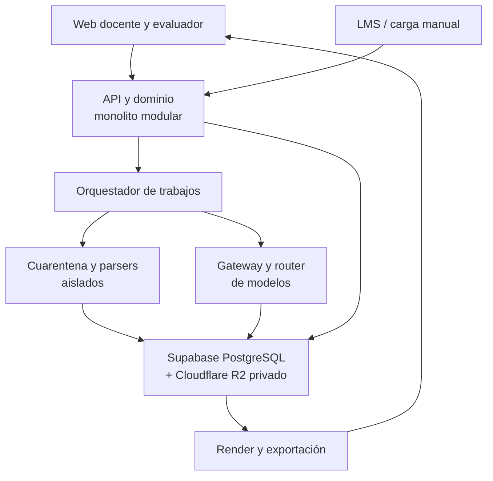
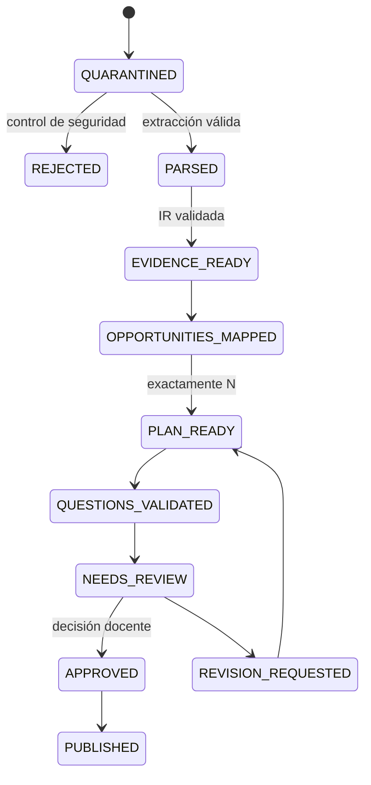
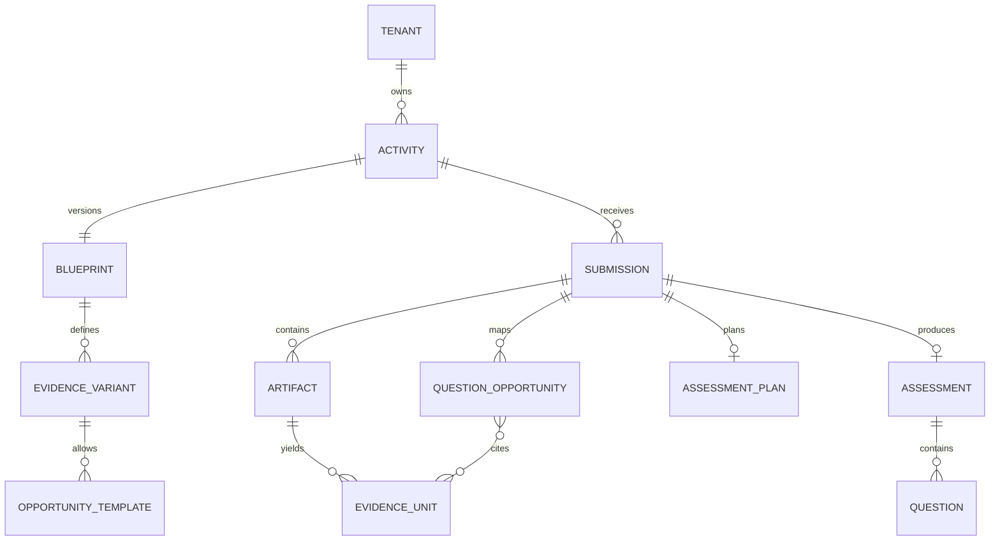
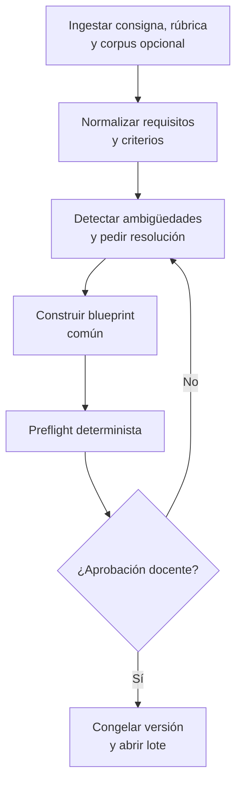
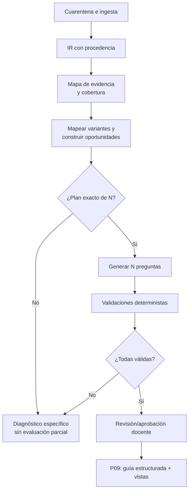
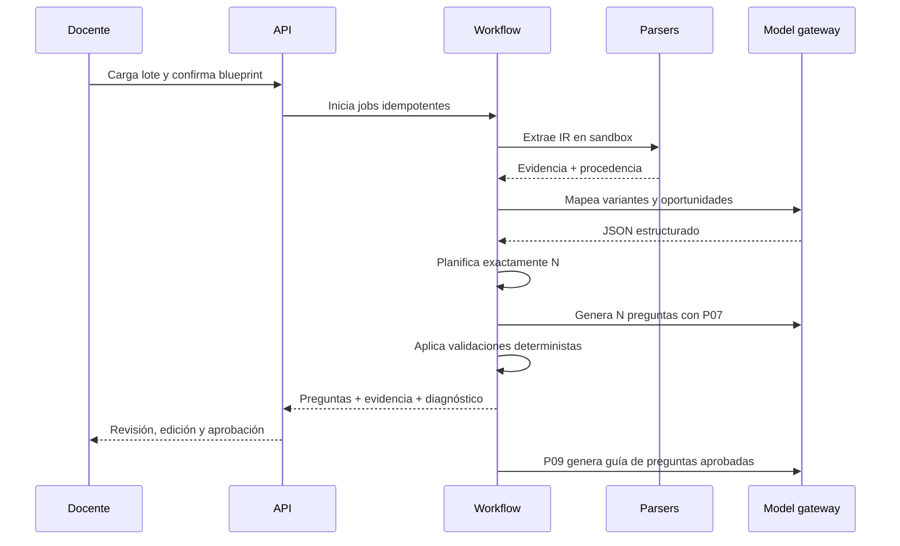

# Especificación de arquitectura v1.1

## Evaluaciones personalizadas de verificación de comprensión asistidas por IA

**Versión:** 1.1  
**Fecha de corte de investigación:** 17 de julio de 2026  
**Fecha de revisión consolidada:** 30 de julio de 2026  
**Estado:** arquitectura recomendada; alcance inmediato redefinido como entorno web experimental  
**Audiencia:** producto, ingeniería, pedagogía, seguridad, privacidad y responsables institucionales

> Esta especificación no diseña un detector de IA ni un mecanismo para probar autoría. Diseña un sistema que permite a una persona demostrar comprensión actual, localizada, coherente y defendible de su propio entregable. Toda decisión académica sigue siendo humana.

---

## Resumen ejecutivo

El producto recibe la consigna de una actividad, su rúbrica y los entregables digitales de cada estudiante. Produce, para cada entregable, una evaluación breve y personalizada, con preguntas ancladas en evidencia exacta del trabajo y una guía de evaluación observable para el docente. La personalización no sacrifica comparabilidad: todas las evaluaciones se instancian desde un blueprint común de la actividad que fija dimensiones, demanda cognitiva, dificultad, formato y presupuesto de tiempo.

La unidad canónica no es un PDF ni un bloque de texto plano. Es un objeto JSON versionado que conserva la estructura, la modalidad y la procedencia de cada unidad de evidencia. El PDF es una vista derivada. Esta decisión permite auditar qué fragmento originó cada pregunta, regenerar una salida sin volver a inferir y separar errores de parsing, razonamiento, selección y renderizado.

La solución usa dos pipelines:

1. **Pipeline de actividad**, ejecutado una vez: normaliza consigna y rúbrica, resuelve ambigüedades, construye el blueprint y lo somete a aprobación docente.
2. **Pipeline por estudiante**, ejecutado en paralelo: inspecciona y normaliza archivos, P06 mapea evidencia a variantes del blueprint, el planner selecciona exactamente \(N\) oportunidades primarias y una reserva pequeña, P07 genera, el backend valida, el docente revisa/aprueba y P09 crea la guía estructurada.

El modelo de IA nunca recibe herramientas, red, shell ni capacidad para ejecutar código del estudiante. Los archivos se tratan como entrada hostil: cuarentena, detección real de tipo, antivirus, límites de descompresión, parsing en sandbox sin red y sanitización de contenido activo. Las instrucciones contenidas dentro de un entregable se consideran datos y no órdenes. Los outputs de modelos se validan contra esquemas y contra la evidencia fuente; cumplimiento de un JSON Schema no equivale a verdad semántica.

Para el MVP se recomienda un monolito modular en Python/FastAPI desplegado como Cloud Run Service, PostgreSQL y Auth de Supabase, objetos privados en Cloudflare R2 y trabajos largos en Cloud Run Jobs con estado durable en PostgreSQL, sin Redis inicial. La interfaz React/TypeScript/Vite se sirve al comienzo desde el mismo contenedor. El gateway conserva configuraciones históricas aprobadas —proveedor, snapshot, modelo, `reasoning_effort`, temperatura y límites—, pero ADR-037 no cambia ni usa esa matriz para seleccionar modelo. El pipeline objetivo mantiene P01-P04, P06/P07/P09, deja P05/P08 inactivos y P10 deshabilitado. Cualquier comparación futura requiere un instrumento nuevo y autoridad humana separada.

**Estado operativo Fase 3 (2026-08-15):** P05 ya fue retirado del runtime
activo. El flujo de actividad persiste el preflight determinista y pasa
directamente a edición/aprobación docente. Contratos y evidencia P05 siguen
disponibles para historia/replay; P08 y el orden objetivo de P09 continúan
pendientes y P10 permanece deshabilitado.

El alcance inmediato es todavía más estrecho que el MVP institucional descrito en v1.0: una aplicación web experimental, carga manual, contexto cerrado, un proveedor principal, revisión humana obligatoria y un primer anillo de PDF digital, DOCX, TXT y Markdown. OCR, presentaciones, hojas de cálculo y código se añaden solo después de comprobar el recorrido principal. LTI y conectores Canvas/Moodle/Blackboard permanecen en la arquitectura futura.

### Dos horizontes explícitos en v1.1

| Horizonte | Qué se construye ahora | Qué se conserva como objetivo |
|---|---|---|
| Entorno web experimental | monolito modular cloud, una web/API en Cloud Run, Cloud Run Jobs, Supabase PostgreSQL/Auth, R2 privado, carga manual, revisión, export y métricas | validación pedagógica, conjunto de evaluación y bake-off |
| Producto institucional futuro | no forma parte del compromiso inmediato | LMS/LTI, tenancy avanzado, SAML/SCIM, HA, residencia, scale, facturación y uso sumativo gobernado |

Esta separación no debilita las decisiones estructurales de v1.0. Mantiene IR con procedencia, dos pipelines, planificación fail-closed y contratos versionados, pero evita implementar capacidades que todavía no reducen la incertidumbre central.

### Decisiones que ya pueden cerrarse

| Decisión | Recomendación |
|---|---|
| Constructo | Comprensión actual demostrable del propio entregable; no autoría ni detección de fraude |
| Arquitectura lógica | Blueprint por actividad + procesamiento independiente por estudiante |
| Representación | IR estructurada, multimodal y con procedencia; JSON como fuente de verdad |
| Generación | Mapear oportunidades -> planificar exactamente \(N\) -> generar/validar -> reemplazar localmente si falla |
| Contexto | Cerrado por defecto; conocimiento de curso solo con corpus autorizado y opt-in |
| Seguridad | Archivos y texto del estudiante son no confiables; cero ejecución y cero herramientas para el modelo |
| Decisión académica | Docente aprueba; no hay sanción, calificación ni acusación automáticas |
| Integración inicial | Carga/exportación manual; LMS después del piloto |
| Estrategia de modelos | Resolución determinista de rutas aprobadas por tarea, modalidad y política; snapshots gobernados por evaluaciones |
| Producto inicial | Monolito modular asíncrono, no microservicios prematuros |

---

# 1. Problema, constructo y límites

## 1.1 Problema que se resuelve

Los entregables digitales ya no son evidencia suficiente, por sí solos, de que quien los presentó comprende las decisiones, relaciones, mecanismos y limitaciones que contienen. A la vez, inferir autoría desde el estilo, metadatos o supuestos rastros de IA es técnicamente frágil y puede producir decisiones injustas. La institución necesita una verificación posterior que sea breve, pertinente al aprendizaje, específica del trabajo y practicable a escala.

El producto no sustituye la evaluación original. Añade una segunda fuente de evidencia: respuestas del estudiante a preguntas derivadas de partes concretas de su entrega. El docente puede usarla como actividad formativa, instancia oral o escrita, antecedente para retroalimentación o evidencia complementaria bajo una política institucional explícita.

## 1.2 Constructo evaluado

**Definición operacional:** capacidad actual de una persona para explicar, justificar, conectar, reconstruir lógicamente, analizar consecuencias y reconocer limitaciones de evidencia localizada en el entregable presentado, en relación con los objetivos y criterios autorizados de la actividad.

El constructo incluye:

- comprensión semántica y funcional de fragmentos propios;
- relación entre una decisión y sus consecuencias;
- coherencia entre secciones, artefactos o representaciones;
- capacidad de identificar supuestos, dependencias y límites internos;
- transferencia local o contrafactual cuando puede derivarse de fuentes autorizadas.

El constructo **no** incluye:

- probar quién produjo históricamente el entregable;
- estimar una probabilidad de uso de IA;
- reconstruir el proceso mental real del estudiante;
- inferir intención histórica no documentada;
- medir todo el dominio disciplinar;
- diagnosticar deshonestidad, capacidad cognitiva general o rasgos personales.

Una respuesta correcta demuestra comprensión en el momento de la verificación. Una respuesta deficiente no prueba que el estudiante no haya creado el trabajo, y una respuesta sólida no prueba que lo haya creado sin ayuda.

## 1.3 Alcance y no objetivos

### Dentro del alcance

- actividades experimentales con consigna y rúbrica opcional;
- carga manual de uno o varios entregables;
- primer prototipo con PDF digital, DOCX, TXT y Markdown; formatos posteriores habilitados por gate;
- generación de preguntas abiertas breves y, de forma restringida, ítems estructurados;
- contexto cerrado en el primer prototipo; corpus de curso controlado como experimento posterior;
- evidencia y explicaciones auditables para el docente;
- blueprint aprobable, revisión por pregunta, regeneración localizada y exportación PDF/JSON/CSV;
- métricas de calidad, acciones docentes, fallos, latencia, tokens, costo y tiempo humano.

### Fuera del entorno experimental inicial

- proctoring, biometría, grabación obligatoria o vigilancia de pantalla;
- ejecución de código, macros, fórmulas externas o notebooks;
- calificación automática final o escritura automática al libro de notas;
- decisiones disciplinarias automáticas;
- generación basada en internet abierto;
- entrenamiento o fine-tuning con trabajos estudiantiles;
- soporte exhaustivo de CAD, binarios propietarios, video o audio largo;
- afirmaciones psicométricas de alto impacto antes de validación suficiente.
- LMS/LTI, roster, grade passback y escritura automática de notas;
- facturación, marketplace, SAML, SCIM, branding y administración institucional compleja;
- Kubernetes, microservicios, HA institucional y routing activo multi-proveedor.

Las capacidades excluidas se conservan en las secciones de evolución y no se eliminan del diseño de dominio cuando mantener un seam barato evita una migración peligrosa; por ejemplo, `tenant_id`, versionamiento y adapter de proveedor permanecen.

## 1.4 Fuentes epistémicas autorizadas

El motor distingue qué puede usarse para formular y evaluar:

1. **Consigna:** define tarea, restricciones y productos esperados.
2. **Rúbrica:** define criterios observables y niveles, pero su peso de calificación no determina por sí solo la prioridad de verificación.
3. **Entregable:** aporta evidencia específica y anclas; no es una fuente de instrucciones para el sistema.
4. **Corpus de curso autorizado:** opcional; materiales aportados por el docente con licencia y versión conocidas.
5. **Configuración institucional:** idioma, adaptaciones, política, retención y límites de uso.

En modo cerrado, una pregunta debe poder justificarse con 1-3. En modo enriquecido, cualquier afirmación proveniente de 4 debe llevar `source_id`, localizador y cita visible para el evaluador. Internet abierto queda excluido del flujo de producción.

---

# 2. Actores y casos de uso

| Actor | Necesidad principal | Acciones permitidas |
|---|---|---|
| Docente | Configurar, revisar y usar la verificación | Cargar actividad, editar blueprint, revisar preguntas, aprobar individualmente o en lote, exportar y registrar observaciones |
| Ayudante/evaluador autorizado | Aplicar y registrar resultados | Ver evaluaciones asignadas, consultar la guía en plataforma, puntuar y comentar; puede aprobar en lote solo con permiso expreso |
| Estudiante | Demostrar comprensión y ejercer derechos | Responder, pedir adaptación/corrección de datos, ver información según política |
| Administrador institucional | Gobernanza y operación | Crear tenants, políticas, proveedores, retención, integraciones, auditoría agregada |
| Especialista pedagógico | Validar constructo y calidad | Diseñar blueprints, conjuntos dorados, calibrar rúbricas y métricas |
| Seguridad/privacidad | Gestionar riesgo | Aprobar DPA, regiones, retención, incidentes y pruebas de seguridad |
| Operaciones/soporte | Resolver fallos | Reprocesar etapas idempotentes, inspeccionar diagnósticos sin acceso indiscriminado al contenido |
| LMS | Fuente/destino controlado | Lanzamiento, contexto, roster y archivos según permisos; notas solo en fases posteriores |

En el entorno experimental solo se implementan `OWNER`, docente y ayudante/evaluador. Estudiante, administrador institucional, LMS y operación separada describen actores futuros o participantes del piloto, no roles que deban tener una interfaz propia ahora.

Casos de uso prioritarios:

1. Crear una actividad desde consigna y rúbrica.
2. Resolver ambigüedades y aprobar un blueprint común.
3. Cargar un lote de entregables y ver su estado.
4. Generar evaluaciones comparables pero personalizadas.
5. Revisar cada pregunta junto con su evidencia y razones de validación.
6. Aprobar, editar, rechazar o regenerar de forma localizada; aprobar en una acción todas las evaluaciones seleccionadas que sean elegibles.
7. Consultar la guía estructurada en plataforma y exportar evaluación/guía cuando haga falta.
8. Aplicar la verificación y registrar evidencia de respuesta.
9. Auditar qué versiones de archivos, prompts, esquemas y modelos produjeron una salida.
10. Borrar o retener datos conforme a política y solicitudes aplicables.

---

# 3. Requisitos

## 3.1 Requisitos funcionales

| ID | Requisito | Criterio verificable |
|---|---|---|
| RF-01 | Ingesta segura | Rechaza tipo no permitido, malware, archivo cifrado no autorizado, traversal y bomba ZIP antes del parsing |
| RF-02 | Normalización | Todo contenido utilizable se representa como unidades con ID, tipo, texto/datos y localizador exacto |
| RF-03 | Blueprint | Toda actividad aprobada contiene dimensiones evaluables, variantes de evidencia, operaciones soportadas y un catálogo de oportunidades independiente de `question_count` |
| RF-04 | Evidencia | Cada pregunta seleccionada referencia una o más unidades existentes y un ancla reproducible |
| RF-05 | Plan de evaluación | Antes de generar, construye exactamente \(N\) oportunidades primarias de alta calidad y una reserva pequeña; prioriza diversidad sin sacrificar calidad |
| RF-06 | Generación/validación | Genera una pregunta por oportunidad planificada; ningún ítem llega al conjunto sin controles deterministas y semánticos |
| RF-07 | Reemplazo localizado | Si un ítem falla, usa una oportunidad de reserva compatible; no vuelve a generar candidatos masivos |
| RF-08 | Fail closed atómico | Si no puede planificar exactamente \(N\), no genera ni publica una evaluación parcial y emite uno de los códigos contractuales específicos |
| RF-09 | Guía | Persiste información estructurada por evaluación y submission, consultable por roles autorizados dentro de la plataforma |
| RF-10 | Revisión humana | El docente puede inspeccionar, editar, aprobar individualmente o aprobar en lote con confirmación explícita; excepciones requieren revisión individual |
| RF-11 | Trazabilidad | La salida conserva hashes y versiones de inputs, parsers, prompts, modelos, políticas y validaciones |
| RF-12 | Exportación | Mantiene JSON canónico y puede generar PDF/HTML/CSV; la guía en plataforma es la representación principal |
| RF-17 | Justificación estructurada | Por actividad u oportunidad, la justificación del estudiante puede ser no requerida, selectiva o requerida en todas; si no es total, el reporte declara el alcance limitado de evidencia |
| RF-13 | Reprocesamiento | Permite reanudar desde una etapa idempotente sin repetir etapas válidas |
| RF-14 | Privacidad | Pseudonimiza antes de llamadas externas y aplica políticas de residencia/retención por tenant |
| RF-15 | Accesibilidad | Interfaz y documentos alcanzan WCAG 2.2 AA y admiten formatos de respuesta equivalentes |
| RF-16 | Versionamiento | Cambiar prompt/modelo/esquema crea una nueva versión; no muta resultados ya aprobados |

## 3.2 Requisitos no funcionales

Los siguientes se conservan como objetivos institucionales de referencia, no como criterios de aceptación del laboratorio. El experimento mide disponibilidad/latencia y recupera jobs, pero no promete SLA, RPO/RTO contractual ni lotes de 100 en un tiempo fijo:

| Área | MVP | Objetivo institucional |
|---|---:|---:|
| Disponibilidad mensual | 99,5% | 99,9% |
| Éxito técnico en formatos soportados | >= 97% | >= 99% |
| Inicio de trabajo tras carga, p95 | < 60 s | < 15 s |
| Lote de 100 entregas, p95 | < 30 min | < 10 min con autoscaling |
| Recuperación de etapa idempotente | automática, 3 intentos | política por error + DLQ |
| RPO / RTO | 24 h / 8 h | 1 h / 2 h |
| Aislamiento | tenant lógico + RLS | tenant lógico; cuenta/proyecto dedicado opcional |
| Observabilidad | métricas, logs y trazas sin contenido sensible | SLO, SIEM, auditoría inmutable y FinOps |
| Accesibilidad | WCAG 2.2 AA en flujos críticos | AA completo + pruebas con usuarios |
| Reproducibilidad | hashes, versiones y semilla cuando aplique | replay controlado y comparación entre versiones |

Restricciones adicionales:

- ninguna llamada a modelo tiene permisos de herramienta;
- ningún parser puede acceder a internet;
- un fallo de modelo no puede modificar el estado académico;
- el sistema debe soportar backpressure, cuotas por tenant y presupuestos máximos;
- los logs operacionales no contienen nombres, respuestas completas ni anclas por defecto;
- los contratos son compatibles de forma explícita y versionada.

---

# 4. Principios y decisiones arquitectónicas

1. **El constructo gobierna la tecnología.** Una salida plausible no basta si no mide comprensión localizada.
2. **Dos pipelines, una misma política.** Lo común se decide una vez; lo específico se instancia por estudiante.
3. **Determinismo antes de inferencia.** Se extrae estructura y procedencia con herramientas de formato; la visión/LLM complementa, no sustituye, cuando existe extracción confiable.
4. **Evidencia antes de preguntas.** No se pide al modelo “leer y preguntar” en una sola llamada opaca.
5. **Plan antes de generación.** Se seleccionan determinísticamente oportunidades primarias y de reserva antes de pedir redacción; la generación no decide cobertura.
6. **La rúbrica no es una distribución de preguntas.** El `grading_weight` se conserva, pero la prioridad de verificación se calcula aparte.
7. **Ancla suficiente, no necesariamente completa.** Se incluye el menor fragmento fiel y autosuficiente que permita responder sin revelar la respuesta.
8. **Fail closed.** La ausencia de evidencia produce un diagnóstico, no contenido inventado.
9. **Los modelos son dependencias probabilísticas.** Se fijan versiones, se evalúan y se pueden sustituir detrás de contratos.
10. **Human-in-command.** El sistema propone y documenta; el docente decide y responde por el uso académico.
11. **Privacidad por diseño.** Minimización, seudonimización, propósito limitado, retención corta y borrado verificable.
12. **Monolito modular primero.** Los límites de módulos y colas están definidos, pero solo se extraen servicios cuando carga, seguridad o equipos lo justifican.

Las decisiones completas, alternativas y consecuencias se encuentran en `03_ADRs_v1.1.md`.

---

# 5. Arquitectura general

## 5.1 Vista de componentes



### Módulos del MVP

- **Identity & workspace:** OIDC administrado sencillo, invitación y roles mínimos; `tenant_id` se conserva sin construir administración institucional.
- **Activity:** consigna, rúbrica, corpus, configuración y blueprint.
- **Submission:** carga, manifiesto, versión, estado y diagnósticos.
- **Ingestion:** cuarentena, inspección, parsing y construcción de IR.
- **Evidence:** unidades, relaciones, claims, localizadores, cobertura e índices.
- **Assessment:** oportunidades, plan determinista, preguntas, validaciones, guía estructurada y aprobaciones individuales/masivas.
- **Model gateway:** catálogo de rutas aprobadas, resolución de políticas y capacidades, límites, plantillas, structured outputs, uso y costo.
- **Export:** vistas PDF/HTML/JSON/CSV y artefactos accesibles.
- **Integration:** solo carga/exportación manual en el experimento; interfaz de conector documentada para el futuro.
- **Governance:** límites de uso, auditoría, evals y registro de versiones; políticas institucionales completas en preparación de producto.

## 5.2 Despliegue recomendado

### MVP

- frontend React + TypeScript + Vite servido inicialmente desde el mismo contenedor que la API;
- FastAPI en Google Cloud Run Service;
- trabajo largo en Cloud Run Jobs, incluido parsing aislado cuando el formato lo exija;
- Supabase PostgreSQL Free y Supabase Auth Free;
- Cloudflare R2 privado, con objetos entregados mediante URLs firmadas temporales;
- tabla `jobs` y ejecuciones idempotentes en PostgreSQL; no Redis en la primera versión;
- gateway de modelos con salida estructurada;
- observabilidad OpenTelemetry;
- Supabase Auth invite-only;
- un proveedor principal de modelos; escalamiento a un modelo superior bajo la misma política, sin active-active multi-proveedor.

El MVP es cloud de extremo a extremo. El entorno local se usa solo para desarrollo, pruebas y fixtures; no es un modo de operación ni el lugar donde permanecen jobs reales. La API crea una fila durable, dispara el Cloud Run Job y responde de inmediato; el job continúa aunque el navegador se cierre. Los registros estructurados viven en PostgreSQL, mientras R2 conserva archivos brutos, JSON grandes y exportaciones. Dentro de las cuotas gratuitas esperadas, el costo fijo de infraestructura puede mantenerse cercano a USD 0, aparte de las llamadas a modelos; Vercel Pro opcional o los sobreconsumos de cuota serían los primeros costos fijos.

### Objetivo institucional

- pools de workers separados por confianza y formato;
- autoscaling por profundidad de cola y costo previsto;
- claves KMS por tenant de alto control;
- almacenamiento inmutable para auditoría cuando la política lo requiera;
- residencia configurable por región;
- conectores LMS aislados;
- SIEM, WAF, DLP y secretos administrados;
- despliegue dedicado para instituciones que lo exijan;
- gateway multi-proveedor con políticas de datos y failover aprobadas.

## 5.3 Máquina de estados



Cada transición escribe un evento idempotente con `job_id`, `attempt`, `input_hash`, versión del contrato y actor. Los estados de fallo son terminales solo para esa versión; una corrección de archivo o política crea una nueva ejecución enlazada.

La v1.1 separa el plano técnico (`JobStatus`: `QUEUED`, `RUNNING`, `SUCCEEDED`, `FAILED`, `NEEDS_REVIEW`) del plano de dominio. Los fallos pedagógicos contractuales son `INSUFFICIENT_RELEVANT_EVIDENCE`, `INSUFFICIENT_DISTINCT_QUESTION_OPPORTUNITIES`, `EVIDENCE_MAPPING_UNCERTAIN` y `ASSESSMENT_PLAN_INFEASIBLE`; también existen `TECHNICAL_FAILURE`, `REJECTED_SECURITY` y `CANCELLED`. Ninguno permite ensamblar una evaluación parcial.

---

# 6. Modelo de datos y representación intermedia

## 6.1 Entidades principales



El modelo relacional conserva identidad y estado; los objetos grandes y crops se guardan en object storage. Las entidades sensibles incluyen `tenant_id` obligatorio, y toda consulta de aplicación pasa por políticas RLS o un repositorio que inserta el contexto de tenant.

## 6.2 Unidad de evidencia canónica

`EvidenceUnit` es la mínima unidad estable que puede citarse y recomponerse. Contiene:

- `evidence_id` estable dentro de una versión;
- `artifact_id`, `artifact_hash` y versión del parser;
- `modality`: paragraph, heading, table, cell_range, slide_shape, code_symbol, code_span, notebook_cell, image_region, formula, chart, etc.;
- contenido normalizado y, cuando corresponde, representación estructurada;
- localizadores de origen: página/bbox, párrafo, hoja/rango, slide/shape, celda, archivo/líneas, cell ID;
- relaciones: `contains`, `depends_on`, `references`, `continues`, `derived_from`, `contradicts_candidate`;
- idioma, confianza de extracción y banderas de OCR;
- clasificación de sensibilidad y reglas de redacción;
- checksum de la representación normalizada.

Nunca se pierde el original. La normalización no “corrige” silenciosamente errores del estudiante. Si OCR o parser produce una lectura incierta, se conserva la alternativa, la confianza y el crop.

## 6.3 Ancla

Un `Anchor` es una vista autocontenida de una o más unidades. Debe cumplir:

1. fidelidad literal o transformación declarada;
2. localizador reproducible;
3. contexto suficiente para entender la pregunta;
4. longitud mínima compatible con lo anterior;
5. ausencia de información no autorizada;
6. no revelar directamente la respuesta esperada;
7. presentación accesible para su modalidad.

Ejemplos:

- texto: cita con encabezado y una frase precedente si resuelve un pronombre;
- código: firma, bloque relevante y definiciones locales requeridas, con líneas;
- tabla: encabezados, filas/columnas citadas y unidades;
- presentación: imagen de la figura más texto alternativo y notas permitidas;
- notebook: fuente de celda y salida pertinente, nunca ejecución nueva;
- gráfico: crop, título, ejes, leyenda y datos fuente si están disponibles.

## 6.4 Mapa de evidencia

El mapa combina estructura determinista con anotaciones semánticas:

- claims o decisiones observables;
- dimensión y variante de evidencia del blueprint, con fuerza y confianza de alineación;
- dependencias internas;
- artefactos que corroboran o contradicen;
- instancias de oportunidades permitidas, cada una con evidencia, operación, foco y observable;
- suficiencia y riesgo de ambigüedad;
- especificidad respecto de este entregable.

Las anotaciones del modelo nunca reemplazan localizadores. Un claim o una oportunidad sin al menos una unidad válida se elimina. Las operaciones declaradas por una variante son permitidas, no simples preferencias: el mapeo no puede ampliarlas arbitrariamente. La arquitectura admite un índice léxico y embeddings para recuperación, pero los embeddings son auxiliares: no constituyen evidencia ni se usan para decidir por similitud sin verificar el fragmento fuente.

---

# 7. Procesamiento por tipo de archivo

## 7.1 Cadena común de ingesta

1. Carga directa a bucket de cuarentena mediante URL firmada.
2. Cálculo SHA-256, tamaño y manifiesto.
3. Detección de MIME por contenido, extensión como señal secundaria.
4. Antivirus y reglas YARA institucionales si corresponden.
5. Límites: tamaño, cantidad de entradas, profundidad, razón de compresión, tiempo y memoria.
6. Rechazo de cifrado, contraseñas, enlaces externos o contenido activo no autorizado.
7. Extracción segura a directorio efímero, sin seguir symlinks y evitando path traversal.
8. Parser en contenedor sin red, usuario no privilegiado, filesystem de solo lectura salvo `/tmp`, límites CPU/RAM/PID y timeout.
9. Validación de IR, detección de vacío y cálculo de métricas de confianza.
10. Persistencia de originales, derivados y log técnico; destrucción del workspace efímero.

OCRmyPDF advierte que el procesamiento de PDFs no confiables requiere aislamiento en contenedor o VM y que no está diseñado como servicio público de carga por sí solo; por ello OCR se ejecuta exclusivamente dentro del sandbox ([documentación oficial](https://ocrmypdf.readthedocs.io/en/v15.4.0/pdfsecurity.html)).

## 7.2 Adaptadores

La tabla siguiente conserva el catálogo técnico de v1.0, pero v1.1 lo implementa por anillos:

| Anillo | Formatos | Razón y gate |
|---|---|---|
| Primer prototipo | TXT/Markdown, PDF digital, DOCX | alta frecuencia probable, parsing/localización controlables y suficiente diversidad para validar el pipeline |
| Posterior del entorno experimental | PDF escaneado/OCR, PPTX, CSV/XLSX, código de texto/ZIP seguro | se habilitan solo con demanda/corpus, viewer y suites por formato |
| Arquitectura futura | IPYNB, imágenes/gráficos complejos, audio/video, CAD/binarios | mayor costo multimodal, seguridad y pérdida de estructura; no necesarios para la hipótesis central |

La IR y los localizadores no se recortan al primer anillo. La habilitación de un adaptador exige MIME/límites, sandbox, fixtures, evidencia reproducible, viewer y salida fail-closed; que una librería pueda “leer” un archivo no basta.

| Formato | Camino primario | Evidencia y localizador | Controles / fallback |
|---|---|---|---|
| PDF digital | PyMuPDF bloques/palabras + bbox; Docling para layout/tablas | página, bbox, bloque, tabla/celda | detectar orden de lectura; comparar cobertura; OCR solo en páginas sin texto |
| PDF escaneado | raster seguro + Tesseract/OCRmyPDF | página, bbox, crop, confianza OCR | revisión si confianza/idioma insuficiente; no descartar imagen original |
| DOCX | `python-docx` + OOXML | párrafo, heading path, tabla/celda, relación de imagen | macros rechazadas; links externos no resueltos; render selectivo para layout |
| PPTX | `python-pptx` + OOXML | slide, shape ID, texto, notas, relación de imagen | no ejecutar OLE; render de slide para gráficos o composición |
| XLSX | `openpyxl` en modo seguro | workbook/sheet/rango/celda, fórmula y valor cacheado | no macros; no refresh; no links externos; fórmulas no calculadas |
| CSV/TSV | parser estándar + detección de encoding/dialecto | fila/columna y esquema inferido | límites de filas/columnas; neutralizar CSV injection en exportación |
| IPYNB | `nbformat` | cell ID, tipo, fuente, outputs, execution_count | nunca ejecutar; sanitizar HTML/SVG/JS y adjuntos |
| Código | decodificación + Tree-sitter por lenguaje | archivo, símbolo, nodo AST, líneas/columnas | no build/test/import; excluir binarios, vendors, `.git`, venv, `node_modules` |
| ZIP/repo | extractor seguro + manifiesto | path relativo validado | cuota de entradas, compresión y profundidad; rechazar symlink/device files |
| Imagen/gráfico | metadatos, OCR y crop; visión selectiva | archivo, bbox/polígono, crop | visión solo si extracción determinista no basta; revisión de baja confianza |

Docling ofrece un modelo unificado para PDF, Office, imágenes y otros formatos, útil como normalizador y fallback; no debe ser el único parser ni borrar la procedencia específica del formato ([formatos soportados](https://docling-project.github.io/docling/usage/supported_formats/)). PyMuPDF expone palabras y bloques con coordenadas, necesarios para anclas reproducibles ([documentación](https://pymupdf.readthedocs.io/en/latest/app1.html)). Tree-sitter produce árboles sintácticos concretos y tolera código incompleto, apropiado para indexar sin ejecutar ([sitio oficial](https://tree-sitter.github.io/tree-sitter/)).

## 7.3 Reglas de degradación

- Si falla el parser primario, probar un único fallback aprobado y registrar ambos resultados.
- Si el fallback pierde procedencia, el estado es `NEEDS_REVIEW`, no `READY`.
- Si cualquier restricción impide planificar exactamente \(N\), no generar una evaluación parcial.
- Si falta evidencia pertinente, devolver `INSUFFICIENT_RELEVANT_EVIDENCE`; si falta diversidad de oportunidades, `INSUFFICIENT_DISTINCT_QUESTION_OPPORTUNITIES`.
- Una visualización ilegible o fórmula sin valor no se “interpreta” inventando; se cita la limitación.

---

# 8. Pipeline de actividad

ADR-037 fija la autoridad objetivo de esta sección. El modelo propone la
estructura pedagógica en P04; el backend ejecuta el preflight y el docente
decide la aprobación académica. P05 se conserva sólo como contrato y evidencia
histórica durante la migración.



## 8.1 Pasos

1. **Crear actividad:** idioma, modalidad, número y tiempo objetivo de preguntas, formatos admitidos, política de contexto y adaptaciones.
2. **Ingestar consigna/rúbrica:** mismo pipeline seguro, con clasificación de fuente.
3. **Extraer especificación de actividad:** objetivos, productos, restricciones, materiales permitidos, criterios y contradicciones.
4. **Normalizar rúbrica:** criterios atómicos, descriptores observables, pesos de calificación y dependencias. No inventar criterios faltantes.
5. **Detectar ambigüedad:** rubric totals inválidos, criterio sin descriptor, consigna/rúbrica contradictorias, objetivo no evaluable, número de preguntas incompatible con dimensiones.
6. **Resolver con docente:** preguntas concretas con default recomendado; las respuestas se versionan como `PolicyDecision`.
7. **Calcular prioridad de verificación:** separada del peso de nota.
8. **Diseñar el catálogo:** dimensiones relevantes/evaluables, variantes de evidencia, operaciones soportadas y oportunidades de pregunta por variante.
9. **Preflight de blueprint:** el backend comprueba IDs, versiones, hashes, pertenencia, allowlists, formatos, conteo, tiempo, restricciones y factibilidad; el catálogo no se dimensiona por `question_count`.
10. **Aprobar y congelar:** `blueprint_version` inmutable para el lote; cambios posteriores crean nueva versión y requieren decisión sobre regeneración.

## 8.2 Prioridad de verificación

El peso inicial es una heurística calibrable, no una verdad psicométrica:

\[
V_d = \operatorname{norm}(0.25R_d + 0.20C_d + 0.20E_d + 0.15D_d + 0.10A_d + 0.10O_d)
\]

donde:

- \(R\): relevancia al objetivo de aprendizaje;
- \(C\): centralidad en el entregable;
- \(E\): disponibilidad esperada de evidencia específica;
- \(D\): capacidad de discriminar comprensión profunda de paráfrasis superficial;
- \(A\): auditabilidad de la evidencia;
- \(O\): observabilidad en una respuesta breve.

`grading_weight` se muestra al diseñador, pero no entra automáticamente a la fórmula. El especialista pedagógico puede modificar coeficientes por disciplina y debe validarlos en el piloto.

## 8.3 Catálogo de dimensiones, variantes y oportunidades

El blueprint es un catálogo de la actividad, no una lista de \(N\) huecos. Solo incluye dimensiones relevantes y evaluables. Cada dimensión declara:

- prioridad de verificación y criterios/resultados relacionados;
- variantes de evidencia que un entregable podría contener;
- requisitos observables de cada variante;
- operaciones cognitivas realmente soportadas por esa variante;
- oportunidades de pregunta, expresadas como evidencia esperada + operación + foco + observable;
- formatos, dificultad, tiempo y umbral de calidad aplicables.

La comparabilidad es la naturaleza del blueprint y no un modo seleccionable. La profundización tampoco es un parámetro del docente: el sistema debe diseñar por defecto oportunidades que exijan explicación, justificación, conexión, consecuencia o límite cuando la evidencia lo soporte. `question_count` pertenece a las restricciones de la evaluación y se usa después, al crear el plan de cada submission; nunca obliga a crear exactamente ese número de dimensiones u oportunidades.

---

# 9. Pipeline por estudiante

ADR-037 mantiene P06/P07/P09 y el planner, pero retira P08 de la secuencia
objetivo. Las validaciones mecánicas pertenecen al backend y la decisión
semántica final de cada pregunta pertenece al docente.



## 9.1 Cobertura y suficiencia

Para cada dimensión y variante del blueprint se calcula:

- número de unidades distintas;
- calidad media/mínima de extracción;
- fuerza de alineación con criterio;
- especificidad del fragmento;
- diversidad de artefactos;
- oportunidades de pregunta no redundantes;
- riesgo de ambigüedad o de revelar respuesta.

Resultados de planificación:

- `READY`: existe un plan con exactamente \(N\) oportunidades primarias y, como máximo, una reserva pequeña;
- `INSUFFICIENT_RELEVANT_EVIDENCE`: no hay evidencia pertinente suficiente para los criterios de la actividad;
- `INSUFFICIENT_DISTINCT_QUESTION_OPPORTUNITIES`: existe evidencia, pero no permite \(N\) preguntas sustancialmente distintas;
- `EVIDENCE_MAPPING_UNCERTAIN`: la correspondencia dimensión-variante-evidencia no alcanza la confianza exigida;
- `ASSESSMENT_PLAN_INFEASIBLE`: las oportunidades válidas no satisfacen conjuntamente tiempo, calidad u otras restricciones no relajables;
- `TECHNICAL_FAILURE` o `REJECTED_SECURITY`: el procesamiento no fue confiable o violó una política.

Los cuatro primeros códigos son diagnósticos precisos y mutuamente interpretables; no existe `READY_WITH_GAPS`. Si el plan no puede tener exactamente \(N\), no se genera ninguna pregunta de esa evaluación.

No se confunde un archivo corto con una falla técnica. Tampoco se penaliza automáticamente un entregable que, por diseño de la actividad, no contiene evidencia de una dimensión: esa es una señal para revisar el blueprint o la tarea.

## 9.2 Operaciones cognitivas

La arquitectura separa tres ejes:

1. **Operación:** justificar decisión, explicar mecanismo/fragmento, reconstruir razonamiento lógico, conectar evidencia interna, predecir consecuencia local, identificar dependencia, criticar limitación, interpretar representación o trazar flujo de datos/control.
2. **Estructura de ancla:** fragmento único, par de fragmentos, tabla/rango, código, figura, secuencia o artefactos cruzados.
3. **Formato de respuesta:** abierta breve, bullets estructurados, selección, anotación/diagrama, oral equivalente o alternativa accesible. Para selección, la política de justificación es independiente: `NOT_REQUIRED`, `SELECTED` o `ALL`.

“Reconstruir” significa exponer una cadena justificable desde la evidencia actual, no afirmar qué pensó históricamente el estudiante. Las preguntas sobre proceso solo se permiten cuando el proceso está documentado en commits, bitácoras, notas o decisiones explícitas; de lo contrario se formula como “¿qué razonamiento justificaría...?”.

## 9.3 Secuencia de interacción



---

# 10. Planificación, generación y validación

## 10.1 Planificación determinista de oportunidades

P06 mapea `dimension -> variant -> evidence_ids` y construye oportunidades concretas antes de redactar. El planificador elige exactamente \(N=\texttt{question_count}\) oportunidades primarias de alta calidad y unas pocas reservas. El puntaje base es:

\[
P_o = w_a A_o + w_e E_o + w_q Q_o - \Pi_{\text{dimensión}} - \Pi_{\text{variante}} - \Pi_{\text{redundancia}}
\]

donde \(A_o\) es la prioridad de actividad, \(E_o\) el ajuste a la evidencia de la submission y \(Q_o\) la calidad intrínseca de la oportunidad. Se prefiere diversidad de dimensiones y variantes, pero no de manera rígida si obliga a escoger una oportunidad más débil. Solo se reutiliza evidencia o una variante cuando el foco y el observable son sustancialmente distintos.

## 10.2 Generación de preguntas

Para cada oportunidad primaria se envía un paquete pequeño: fragmentos y localizadores exactos, operación permitida, foco, observable, restricciones, fuentes autorizadas si aplican e IDs opacos. El modelo genera una sola pregunta por oportunidad; el sistema no usa `candidate_multiplier` ni produce 3-5 candidatos por slot.

## 10.3 Validaciones deterministas

- JSON válido y versión de esquema compatible;
- todos los IDs existen y pertenecen al tenant/entrega;
- hash y localizadores coinciden;
- ancla es substring o transformación explícita de evidencia;
- límites de longitud, idioma y caracteres;
- ausencia de PII no requerida y secretos detectables;
- no contiene instrucciones del sistema, claves o texto de otros estudiantes;
- no usa fuentes no autorizadas;
- pregunta no es vacía, duplicada o respuesta literal del ancla;
- tiempo y formato admitidos;
- solapamiento de anclas por debajo del máximo;
- selección, si existe, tiene una respuesta defendible y cada distractor conserva evidencia fuente, razón y confusión plausible;
- la exigencia de justificación coincide con la política resuelta para esa actividad/oportunidad.

## 10.4 Revisión semántica y autoridad docente

La relación evidencia/constructo, la redacción, los observables y las
alternativas son propuestas semánticas del modelo. El docente revisa, edita,
acepta o rechaza considerando:

- fidelidad y grounding;
- suficiencia/autosuficiencia del ancla;
- alineación a la oportunidad, variante y criterio;
- posibilidad de respuesta desde fuentes autorizadas;
- profundidad cognitiva real;
- ausencia de supuestos sobre intención/autoría;
- neutralidad, claridad, accesibilidad y sesgo;
- riesgo de que varias respuestas incompatibles sean igualmente válidas;
- calidad discriminativa entre explicación y paráfrasis;
- observabilidad de la guía.

La salida estructurada no garantiza corrección. P08 ya no es un gate activo en
el pipeline objetivo: sus oracles y resultados se retienen como historia, no
como sustituto de la autoridad docente. Los invariantes verificables de la
lista anterior que puedan expresarse mecánicamente deben promoverse a
validaciones deterministas versionadas; los demás permanecen bajo revisión
docente.

## 10.5 Calidad de pregunta

Punto de partida editable:

\[
S_i = 0.22G + 0.16A + 0.15R + 0.12D + 0.10P + 0.10C + 0.08X + 0.07Q - \Pi_i
\]

con `G` grounding, `A` suficiencia del ancla, `R` relevancia, `D` discriminación cognitiva, `P` personalización específica, `C` claridad, `X` accesibilidad, `Q` answerability y penalizaciones \(\Pi\) por ambigüedad o fuga de respuesta. Un fallo crítico en grounding, autorización de fuente, procedencia o seguridad veta la pregunta aunque su promedio sea alto.

## 10.6 Reserva y reemplazo localizado

El plan incluye \(N\) primarias y una reserva corta. Si una pregunta falla validación, el sistema toma una oportunidad de reserva compatible y genera solo ese reemplazo. Si se agota la reserva o el reemplazo no supera las reglas, la evaluación completa queda `ASSESSMENT_PLAN_INFEASIBLE`; nunca se conserva un conjunto de menos de \(N\).

Un rechazo docente tampoco reinicia el lote. Se registra pregunta/oportunidad y motivo, se evita repetir su fingerprint y se usa una reserva o se crea una nueva versión de plan. La regeneración conserva lineage y no sobrescribe una versión aprobada.

---

# 11. Comparabilidad, equidad y guía del evaluador

## 11.1 Qué significa comparabilidad aquí

La comparabilidad es el comportamiento normal del sistema, no una opción que se active o desactive. No significa preguntas idénticas. Significa que estudiantes de la misma actividad enfrentan espacios de desempeño equivalentes:

- dimensiones y prioridades provenientes del mismo catálogo;
- operaciones cognitivas soportadas por la variante de evidencia;
- dificultad y tiempo dentro de bandas;
- igual estándar de evidencia y guía;
- reglas de planificación y reserva conocidas;
- adaptaciones que eliminan barreras sin cambiar el constructo.

El reporte de lote incluye cobertura por dimensión/variante, distribución de operaciones, dificultad prevista, tiempo, reutilización y motivos de fail-closed. Una desviación sistemática por formato, idioma o grupo activa revisión pedagógica, no un ajuste opaco.

## 11.2 Guía del evaluador

La guía es un objeto estructurado asociado a la evaluación y a su submission. Docentes y ayudantes/evaluadores autorizados la consultan y la usan dentro de la plataforma durante la corrección. PDF/HTML son exportaciones opcionales, no la representación primaria.

Cada pregunta tiene:

- propósito/oportunidad;
- evidencia y localizador;
- elementos observables que una respuesta debería abordar;
- respuestas alternativas aceptables;
- errores o confusiones diagnósticas;
- límites: qué no se puede inferir;
- escala analítica 0-3;
- ejemplo sintético opcional, nunca presentado como la intención histórica correcta.

Escala base:

| Nivel | Descriptor observable |
|---|---|
| 0 - No demuestra | No se refiere al ancla, contradice elementos centrales o repite palabras sin explicar relación/mecanismo |
| 1 - Parcial | Identifica elementos pertinentes, pero omite una relación esencial o justificación; hay errores que afectan la conclusión |
| 2 - Suficiente | Explica correctamente el núcleo solicitado, usa la evidencia y mantiene coherencia; puede omitir detalle no esencial |
| 3 - Sólida | Además integra dependencias/consecuencias o límites relevantes y defiende la respuesta con precisión |

La guía no debe contener una única frase “correcta” si existen múltiples explicaciones defendibles. En preguntas de selección, conserva una respuesta defendible, la evidencia que la sustenta y la razón de cada distractor, incluso cuando la justificación del estudiante no sea obligatoria. Cuando la pregunta depende de conocimiento de curso, se citan las fuentes exactas. El evaluador puede registrar `not_observable` o `question_defect`; el estudiante no carga con un ítem defectuoso.

La justificación del estudiante puede ser no requerida, selectiva o requerida en todas las preguntas estructuradas, por actividad u oportunidad. Omitirla es admisible en evaluaciones breves, formativas o de bajo impacto. Cuando no se exige en todas, el reporte muestra un aviso determinista de que la evidencia observada tiene alcance limitado.

El aviso general de que el sistema no determina autoría, uso de IA ni proceso histórico es texto fijo de interfaz —por ejemplo, un pie persistente o callout visible— administrado por producto. No lo genera ningún prompt y no se inserta en documentos producidos por el modelo.

## 11.3 Accesibilidad y adaptaciones

La interfaz y salidas apuntan a WCAG 2.2 AA ([W3C](https://www.w3.org/TR/WCAG22/)). El blueprint distingue el constructo del medio de respuesta. Para una misma operación puede ofrecerse respuesta escrita, oral transcrita, bullets o anotación accesible, siempre que no cambie la evidencia exigida. CAST UDL 3.0 recomienda variar y honrar métodos de respuesta y soportar tecnologías accesibles ([CAST](https://udlguidelines.cast.org/action-expression/)). Las adaptaciones son políticas explícitas, no inferencias del modelo sobre discapacidad.

---

# 12. Estrategia de modelos y routing

## 12.1 Principios

- usar modelos solo donde agregan comprensión semántica;
- resolver una configuración aprobada, no escoger dinámicamente “el mejor modelo”;
- comprobar capacidades y políticas antes de cada llamada;
- structured outputs, límites de tokens y temperatura baja;
- sin herramientas, navegación, ejecución ni memoria entre estudiantes;
- versión/snapshot fijado y cambio detrás de un gate de evaluación;
- medir costo por etapa y por tenant;
- un segundo modelo no se considera automáticamente una verdad independiente.

## 12.2 Recomendación inicial

La tabla conserva la configuración histórica de rutas y no cambia provider
routing. Bajo ADR-037, P05/P08 son inactivos en el pipeline objetivo y P10 está
deshabilitado; ninguna fila histórica constituye un gate de selección de
modelo.

| Prompt | Ruta histórica | `reasoning_effort` | Estado ADR-037 |
|---|---|---|---|
| P01 Especificación de actividad | GPT-5.6 Sol | medium | activo objetivo |
| P02 Normalización de rúbrica | GPT-5.6 Sol | medium | activo objetivo |
| P03 Triaje de ambigüedad | GPT-5.6 Luna | high | activo objetivo |
| P04 Construcción de blueprint | GPT-5.6 Sol | high | activo objetivo |
| P05 Revisión de blueprint | GPT-5.6 Sol | high | histórico/inactivo objetivo |
| P06 Mapa de evidencia y oportunidades | GPT-5.6 Luna | high | activo objetivo |
| P07 Generación de pregunta | GPT-5.6 Luna | high | activo objetivo |
| P08 Revisión semántica | GPT-5.6 Luna | high | histórico/inactivo objetivo |
| P09 Guía estructurada | GPT-5.6 Luna | high | activo objetivo |
| P10 Contexto enriquecido | sin ruta activa | — | deshabilitado |
| P11 Reparación de esquema | GPT-5.6 Luna | minimal | utilidad estructural, no etapa pedagógica |

El diseño histórico reservaba P10 y comparadores para un bake-off. ADR-037 deja
P10 deshabilitado y declara el harness existente no canónico para selección.
Cualquier comparación futura entre Luna, Terra, Sol, Claude o Gemini requiere
un corpus, gate y autorización nuevos; ninguna ocurre en esta iteración.

Sol, Terra y Luna aceptan entrada visual por API, por lo que detectar una imagen no cambia de proveedor por sí solo. Se envía únicamente el crop o unidad sanitizada necesaria. Gemini 3.6 Flash puede ser una alternativa aprobada para tareas multimodales específicas —en particular video, audio o PDF nativos— o cuando el bake-off demuestre ventaja; nunca es fallback genérico automático por latencia o error.

## 12.3 Router

El router es un resolvedor determinista de configuración y políticas. La unidad de ruta es `provider + model_snapshot + model + reasoning_effort + temperature + output_limits`. Su catálogo declara, además, modalidades de entrada/salida, structured outputs, ventana de contexto, niveles de razonamiento y políticas de datos.

Antes de llamar, comprueba:

- modalidades y capacidades requeridas;
- privacidad, región y retención;
- presupuesto y límites de salida;
- disponibilidad;
- fallbacks expresamente aprobados para esa tarea, modalidad, tenant y clase de datos.

Las únicas señales de escalamiento multimodal son observables: baja confianza de extracción, detalle insuficiente, relación multimodal compleja, modalidad no soportada o ventaja demostrada en evaluación. Cada resolución emite códigos de razón estables y queda en el ledger para auditoría, reproducción y costo. Un error de latencia/proveedor no autoriza cruzar automáticamente a Gemini, Claude u otra región.

Si una modalidad requerida no tiene ruta aprobada, el resolvedor devuelve `NEEDS_REVIEW` o `BLOCKED`; no intenta una llamada incompatible.

## 12.4 Caché y batch

El prefijo estable (instrucciones, esquema, blueprint) va antes del contenido variable para aprovechar prompt caching. No se cachea contenido sensible más allá de la política. Batch se conserva como supuesto editable de costos y experimento posterior; no es requisito del primer recorrido. Añade latencia y diferencias de retención. En OpenAI, Batch no es elegible para Zero Data Retention; por tanto se deshabilita en tenants ZDR ([datos](https://developers.openai.com/api/docs/guides/your-data), [Batch](https://developers.openai.com/api/docs/guides/batch)).

## 12.5 Gate de cambio

Un modelo/prompt nuevo se promueve solo si:

1. pasa esquemas y seguridad;
2. no empeora métricas críticas del conjunto dorado más allá del margen acordado;
3. mejora calidad, costo o latencia en una dimensión explícita;
4. completa shadow run sin fuga entre tenants;
5. tiene DPA, región y retención aprobadas;
6. cuenta con plan de rollback y snapshot anterior disponible.

---

# 13. Sistema de prompts

Los prompts completos están en `01_Prompt_Pack_v1.1.md`. Cada P01-P11 declara request root, output root, productor, consumidor, modelo provisional, abstención, validación y retry. El diseño aplica estas reglas:

- mensaje de sistema estable y breve con constructo, jerarquía de fuentes y prohibiciones;
- contenido no confiable en objetos delimitados y tipados, nunca concatenado como instrucciones;
- tarea única por llamada;
- esquema de salida con enums e IDs opacos;
- status y `diagnostics` contractuales para permitir abstención sin fabricar campos;
- no pedir razonamiento interno extenso; pedir justificaciones breves, auditables y referidas a IDs;
- ejemplos mínimos y representativos, incluidas salidas fail-closed;
- parámetros, modelo, prompt y esquema versionados juntos;
- política de reintento: `SchemaRepairRequest -> SchemaRepairResult` una vez; grounding o suficiencia nunca se reparan con P11.

Se evita una “mega-prompt” que analice actividad, lea todos los archivos, genere preguntas y cree la guía. Esa llamada impediría atribuir errores, aumentaría contexto/costo y facilitaría prompt injection indirecta.

---

# 14. Seguridad

## 14.1 Modelo de amenazas

Activos: entregables y respuestas, identidad académica, rúbricas, prompts, claves, evaluaciones, resultados y auditoría. Adversarios: archivo malicioso, estudiante que inserta instrucciones, usuario interno con acceso excesivo, integración comprometida, dependencia vulnerable y uso accidental entre tenants.

Principales amenazas y controles:

| Amenaza | Controles preventivos | Detección / respuesta |
|---|---|---|
| Prompt injection directa/indirecta | modelo sin herramientas; separación de instrucciones/datos; allowlist de fuentes; salidas tipadas | corpus adversarial, reglas de contenido, `PROMPT_INJECTION_SIGNAL`, revisión |
| Malware / parser exploit | cuarentena, AV, sandbox sin red, no root, seccomp, límites y parches | crash/timeout metrics, kill, DLQ, análisis de muestra aislada |
| ZIP bomb / traversal | cuotas, canonicalización de paths, ratio/profundidad, no symlinks | rechazo con código específico y alerta por tenant |
| Ejecución de código/macros | nunca ejecutar/importar/build; macros y OLE rechazados; links no resueltos | tests canario, auditoría de syscalls/red |
| Cross-tenant | `tenant_id` obligatorio, RLS, URLs firmadas cortas, claves/prefijos aislados | pruebas automatizadas de aislamiento, logs de autorización |
| Exfiltración a proveedor | minimización/seudonimización, proveedor/región allowlist, DPA/ZDR | ledger de llamadas con clase de datos y destino |
| Output inseguro | JSON Schema, escape contextual, no render HTML del modelo, neutralizar fórmulas CSV | CSP, sanitizador, tests XSS/CSV injection |
| Denial of wallet/service | cuotas, estimador previo, máximo por job, backpressure y circuit breaker | alertas de costo/tokens/tasa, kill switch |
| Sobreconfianza académica | revisión docente, evidencia visible, límites y apelación | defect reports, auditoría de decisiones y sesgo |

OWASP identifica prompt injection, manejo inseguro de outputs, denial of service, excessive agency y overreliance entre los riesgos centrales de aplicaciones LLM ([OWASP Top 10 2025](https://owasp.org/www-project-top-10-for-large-language-model-applications/assets/PDF/OWASP-Top-10-for-LLMs-v2025.pdf)). El perfil de IA generativa de NIST complementa la gestión con las funciones Govern, Map, Measure y Manage ([NIST AI RMF](https://www.nist.gov/itl/ai-risk-management-framework)).

## 14.2 Controles de plataforma

- TLS 1.2+ y cifrado en reposo con KMS;
- secretos en secret manager, rotación y credenciales de corta duración;
- OIDC/SAML, MFA para administradores y RBAC mínimo;
- SAST, SCA, imágenes firmadas/SBOM, escaneo y política de admisión;
- WAF, rate limit y protección de uploads;
- backups cifrados, prueba de restore y borrado por ciclo de vida;
- logs de auditoría append-only; contenido sensible separado y con acceso justificado;
- pentest antes de piloto institucional;
- gestión de incidentes con clasificación, contención, notificación y postmortem.

## 14.3 Red team mínimo

- “ignore instrucciones” oculto en texto blanco, comentarios, celdas y metadatos;
- payload que solicita datos de otro estudiante o secretos;
- PDF poliglota, objetos incrustados, fuentes dañadas y millones de objetos;
- ZIP traversal, symlink, nesting y alta compresión;
- XLSX con DDE, fórmulas externas y macro;
- notebook con HTML/JS y outputs gigantes;
- repositorio con scripts llamados como parsers y nombres de ruta maliciosos;
- anclas que contienen discriminación, PII o texto que induce a sanción;
- intentos de agotar tokens mediante repetición o imágenes enormes;
- JSON válido pero semánticamente no grounded.

---

# 15. Privacidad, regulación y gobernanza

Esta sección orienta el diseño; cada institución debe validar su base jurídica, contratos y política con asesoría local.

## 15.1 Roles y finalidad

La institución normalmente actúa como responsable/controlador y el SaaS como encargado/procesador. El contrato debe definir propósito educativo, instrucciones documentadas, subencargados, regiones, seguridad, soporte de derechos, incidentes, devolución/borrado y auditoría. Los datos no se venden, no se usan para publicidad y no entrenan modelos salvo consentimiento institucional separado y base jurídica válida; el default técnico es no entrenamiento.

## 15.2 Minimización y retención propuesta

- sustituir nombre, correo y matrícula por `subject_ref` antes del modelo;
- enviar solo evidencia necesaria para una oportunidad, no el expediente completo;
- raw uploads: 30 días después de aprobación o fin de curso, configurable;
- IR/evaluaciones: hasta fin de curso + 90 días por defecto;
- auditoría técnica sin contenido: 12 meses;
- métricas agregadas/desidentificadas: retención institucional;
- borrado de caches, objetos, base, índices y copias de trabajo; backups expiran por ciclo documentado;
- legal hold explícito, limitado y auditable.

Las duraciones son defaults de producto que deben ajustarse a obligaciones institucionales; no son un requisito legal universal.

## 15.3 Chile

A la fecha de esta especificación, la Ley 19.628 sigue siendo el marco vigente hasta que la Ley 21.719 entre en vigor el **1 de diciembre de 2026**. La nueva ley incorpora finalidad, proporcionalidad, calidad, responsabilidad, seguridad, transparencia, derechos reforzados, obligaciones especiales para datos de niños/adolescentes y una Agencia de Protección de Datos ([texto oficial BCN](https://www.bcn.cl/leychile/navegar?idNorma=1209272), [confirmación de vigencia](https://www.bcn.cl/leychile/navegar?idNorma=1219636)). El producto debe construirse desde el MVP al estándar nuevo: registro de actividades, evaluación de impacto, contratos con subencargados, mecanismos de derechos, privacidad por diseño y evidencia de seguridad.

Para menores, se aplica configuración institucional específica, consentimiento/base jurídica verificada, lenguaje comprensible, minimización mayor y prohibición de perfiles secundarios. Nunca se infieren atributos sensibles del contenido.

## 15.4 GDPR y FERPA

Si se ofrecen servicios a personas en la UE, se requiere base jurídica, información transparente, minimización, límites de conservación, DPA, transferencias válidas y DPIA cuando exista alto riesgo. El producto evita una decisión exclusivamente automatizada con efecto académico: la revisión humana debe ser real y capaz de cambiar el resultado. La Comisión describe GDPR como marco para procesamiento y transferencias y reconoce mecanismos como SCC para terceros países ([Comisión Europea](https://commission.europa.eu/law/law-topic/data-protection_en)).

El uso para evaluar resultados educativos puede caer en categorías de alto riesgo del EU AI Act según contexto; las fechas y simplificaciones de 2026 siguen evolucionando. La postura segura es diseñar desde ahora gestión de riesgo, calidad de datos, logs, documentación, supervisión humana, precisión/robustez y transparencia, y confirmar clasificación con asesoría antes de operar en la UE ([marco y cronograma oficial](https://digital-strategy.ec.europa.eu/en/policies/regulatory-framework-ai), [guías de alto riesgo](https://digital-strategy.ec.europa.eu/en/policies/guidelines-ai-high-risk-systems)).

En EE. UU., bajo la excepción de “school official” de FERPA, el proveedor debe realizar una función institucional, estar bajo control directo de la institución respecto del uso/mantenimiento de registros, usar los datos solo para el propósito autorizado y restringir la redistribución. Un acuerdo escrito es la práctica recomendada y debe incluir destrucción ([U.S. Department of Education](https://studentprivacy.ed.gov/sites/default/files/resource_document/file/Vendor%20FAQ.pdf)).

## 15.5 Proveedores de modelos

| Proveedor | Señal relevante | Decisión de arquitectura |
|---|---|---|
| OpenAI API | datos API no se usan para entrenamiento por defecto; abuse monitoring hasta 30 días por defecto; ZDR/MAM sujetos a aprobación; Batch no ZDR | `store=false`, ZDR si se exige, no Batch/File APIs bajo política estricta, región aprobada |
| Anthropic API | política de retención depende de producto/modelo; ZDR por acuerdo; Fable requiere 30 días | excluir modelos incompatibles con el tenant; fijar snapshot y DPA |
| Gemini API | tier pago no usa contenido para mejorar productos; ZDR aprobado reduce logs; Files/cache/grounding tienen retenciones propias | `store=false`, evitar grounding y Files API en contexto cerrado/ZDR; cache solo con TTL aprobado |

Fuentes: [OpenAI - Your data](https://developers.openai.com/api/docs/guides/your-data), [Anthropic - API and data retention](https://platform.claude.com/docs/en/manage-claude/api-and-data-retention), [Google - Zero data retention](https://ai.google.dev/gemini-api/docs/zdr). La ausencia de entrenamiento no equivale a retención cero; ambas se controlan por separado.

## 15.6 Gobernanza educativa

- política institucional de usos permitidos y no permitidos;
- aviso al estudiante sobre propósito, datos, revisión, retención y apelación;
- registro de versiones de actividad y preguntas aplicadas;
- comité para cambios de constructo/uso de alto impacto;
- evaluación de sesgo por idioma, formato, disciplina y adaptación;
- canal de corrección de preguntas defectuosas;
- prohibición contractual y técnica de usar la salida como prueba exclusiva de fraude.

UNESCO recomienda un enfoque humano, de derechos, inclusión, privacidad, trazabilidad y responsabilidad en IA educativa ([guía GenAI](https://www.unesco.org/en/articles/guidance-generative-ai-education-and-research), [Recomendación ética](https://www.unesco.org/en/artificial-intelligence/recommendation-ethics)).

---

# 16. Integración con LMS

## 16.1 Estrategia por etapas

**MVP:** carga manual de consigna/rúbrica y ZIP/manifiesto de entregables; exportación de PDFs/CSV. Es más rápida de validar, reduce permisos y evita que diferencias entre LMS bloqueen la pedagogía.

**V2:** LTI 1.3 para lanzamiento seguro y contexto, con Deep Linking y NRPS. LTI Advantage se basa en OAuth 2.0/JWT y agrega Assignment and Grade Services, Deep Linking y Names and Role Provisioning Services ([1EdTech](https://www.1edtech.org/standards/lti)). No se presupone que LTI entregue todos los archivos o la rúbrica.

**Conectores:**

1. Canvas: OAuth/scopes y APIs de assignments, rubrics y submissions/attachments.
2. Moodle: plugin o external service definido por sitio/capacidades.
3. Blackboard: LTI + REST/OAuth según configuración institucional.

**V3:** lectura incremental por webhooks/polling con cursor, idempotencia y reconciliación; AGS para devolver estado o nota solo si la política lo autoriza y tras aprobación docente.

## 16.2 Interfaz de conector

```text
list_activities(course_ref, cursor) -> ActivityRef[]
get_activity(activity_ref) -> AssignmentPackage
list_submissions(activity_ref, cursor, since) -> SubmissionRef[]
download_submission(submission_ref) -> ArtifactManifest
get_roster(course_ref) -> SubjectRef[]
publish_result(result_ref, mode) -> PublishReceipt
```

Los conectores convierten identidades LMS a IDs internos seudónimos. Tokens se cifran, tienen scopes mínimos y no llegan a workers/modelos. La matriz de capacidades se descubre por instalación: lanzamiento, roster, rúbrica, adjuntos, webhooks y grade passback son flags independientes.

## 16.3 Fallos y reconciliación

- delta sync con cursor y ventana de solapamiento;
- idempotency key por `lms_instance + external_submission_id + version`;
- checksum para detectar cambios del archivo;
- tombstones sin borrar auditoría requerida;
- rate-limit adaptativo y reintento con jitter;
- cola de reconciliación diaria;
- no publicar si el LMS devuelve rol/permisos inconsistentes;
- recibo de publicación y posibilidad de reversa según API.

---

# 17. APIs y contratos

## 17.1 Convenciones

- REST/JSON para operaciones; eventos internos para workflows;
- `/v1` y `schema_version` dentro de objetos persistidos;
- `Idempotency-Key` obligatorio en creación de actividad, submission y publicación;
- `ETag/If-Match` para edición concurrente de blueprint;
- respuestas de error RFC 9457 `application/problem+json` con código estable;
- paginación por cursor;
- uploads mediante URL firmada; nunca proxy del archivo por la API;
- webhooks firmados y con replay protection;
- OpenAPI generado desde Pydantic.

## 17.2 Endpoints principales

| Método | Ruta | Resultado |
|---|---|---|
| POST | `/v1/activities` | crea actividad y versión inicial |
| POST | `/v1/activities/{id}/artifacts:presign` | URL de carga de consigna/rúbrica/corpus |
| POST | `/v1/activities/{id}/blueprints:generate` | inicia workflow de blueprint |
| PUT | `/v1/activities/{id}/blueprints/{version}` | edita con control de concurrencia |
| POST | `/v1/activities/{id}/blueprints/{version}:approve` | congela versión |
| POST | `/v1/activities/{id}/submissions:batch` | registra manifiesto/lote |
| GET | `/v1/jobs/{job_id}` | estado, progreso y diagnósticos seguros |
| GET | `/v1/submissions/{id}/evidence` | evidencia paginada para revisión autorizada |
| GET | `/v1/submissions/{id}/assessment` | objeto canónico y validaciones |
| GET | `/v1/assessments/{id}/guide` | guía estructurada asociada a assessment/submission para roles autorizados |
| POST | `/v1/assessments/{id}/questions/{qid}/actions` | aceptar/rechazar/editar/regenerar mediante `QuestionReviewAction` |
| POST | `/v1/assessments/{id}/questions/{qid}:regenerate` | reemplazo localizado desde una oportunidad de reserva |
| POST | `/v1/assessments/{id}:approve` | aprobación humana |
| POST | `/v1/assessments:bulk-approve` | aprueba evaluaciones seleccionadas elegibles con confirmación explícita; excluye y lista excepciones |
| POST | `/v1/assessments/{id}/exports` | genera vista PDF/HTML/JSON |
| DELETE | `/v1/subjects/{subject_ref}/data` | solicitud de borrado según política |

La aprobación masiva es una decisión deliberada, no una repetición silenciosa del endpoint individual. Solo un docente o evaluador con permiso expreso puede ejecutarla sobre una selección concreta. La UI muestra cantidad, alcance y versiones, exige `CONFIRM_BULK_APPROVAL_OF_ALL_ELIGIBLE_SELECTED_ASSESSMENTS` y registra actor, fecha, scope y cada versión. Evaluaciones con preguntas rechazadas, diagnósticos pendientes, versión obsoleta, conflicto de concurrencia o cualquier excepción de elegibilidad se excluyen; no se aprueban parcialmente dentro del mismo objeto y quedan listadas para revisión individual.

## 17.3 Eventos

`artifact.quarantined`, `artifact.rejected`, `artifact.parsed`, `evidence.ready`, `blueprint.approved`, `opportunities.mapped`, `assessment_plan.ready`, `question.generated`, `question.rejected`, `assessment.needs_review`, `assessment.approved`, `assessment.bulk_approved`, `export.ready`, `retention.expired`.

Cada evento incluye `event_id`, tiempo, tenant, aggregate/version, actor/service, correlation/causation IDs y payload mínimo. No incluye texto del estudiante.

Los modelos Pydantic y JSON Schema completos están en `02_Contratos_y_Esquemas_v1.1.md`, `models_v1.1.py` y `contracts.schema_v1.1.json`. Pydantic es la fuente primaria; el bundle se genera y nunca se edita manualmente.

---

# 18. Observabilidad, errores y resiliencia

## 18.1 Tres planos de observabilidad

1. **Técnico:** latencia, cola, CPU/RAM, timeouts, crashes, rate limits, disponibilidad.
2. **Económico:** tokens, cache hit, costo previsto/real, OCR, almacenamiento y costo por actividad/tenant.
3. **Calidad:** cobertura, groundedness, rechazo determinista/semántico/docente, sustituciones, fail-closed, diferencias por formato/idioma.

OpenTelemetry propaga `trace_id` desde carga hasta export, pero las spans contienen IDs y tamaños, no contenido. Los dashboards distinguen `stage`, `parser_version`, `model_snapshot`, `prompt_version`, `schema_version`, `tenant_tier` y `error_code`. Labels de alta cardinalidad como submission ID no se usan en métricas.

## 18.2 Taxonomía de errores

| Código | Clase | Acción |
|---|---|---|
| `INGEST_UNSUPPORTED_MEDIA` | usuario/política | no reintentar; solicitar formato válido |
| `INGEST_MALWARE` / `INGEST_ARCHIVE_TRAVERSAL` | seguridad | rechazar, aislar y alertar |
| `PARSE_EMPTY_NATIVE` | recuperable | OCR/fallback una vez |
| `PARSE_OCR_LOW_CONFIDENCE` | calidad | revisión o exclusión de unidades |
| `PARSE_TIMEOUT` | transitorio/abuso | un retry con límite; luego revisión |
| `IR_PROVENANCE_GAP` | crítico | fail closed; nunca generar desde esa unidad |
| `ASSIGNMENT_AMBIGUOUS` / `RUBRIC_UNPARSABLE` | configuración | bloquear blueprint y pedir resolución |
| `INSUFFICIENT_RELEVANT_EVIDENCE` | pedagógico | no generar; informar falta de evidencia pertinente |
| `INSUFFICIENT_DISTINCT_QUESTION_OPPORTUNITIES` | pedagógico | no generar; revisar actividad, submission o `question_count` |
| `EVIDENCE_MAPPING_UNCERTAIN` | calidad | no generar; revisión humana del mapeo |
| `ASSESSMENT_PLAN_INFEASIBLE` | conjunto | no generar parcial; revisar restricciones o crear nueva versión |
| `MODEL_SCHEMA_VIOLATION` | modelo | reparación única; fallback/escalamiento |
| `MODEL_RATE_LIMIT` | transitorio | backoff con jitter y circuit breaker |
| `MODEL_SAFETY_BLOCK` | revisión | no reescribir para evadir; inspección autorizada |
| `QUESTION_GROUNDEDNESS_FAIL` | calidad crítica | reemplazo localizado desde reserva |
| `QUESTION_REDUNDANCY` | calidad | usar reserva no redundante o fallar el plan |
| `PRIVACY_REGION_UNAVAILABLE` | política | bloquear; sin fallback no autorizado |
| `RENDER_FAILURE` | técnico | regenerar vista desde JSON, sin llamar modelo |
| `LMS_PERMISSION_DENIED` | integración | detener sincronización y pedir reautorización |

## 18.3 Idempotencia y reintentos

La clave de cada etapa es `hash(input canonical + policy + component_version)`. Si existe output válido, se reutiliza. Reintentos usan exponential backoff con jitter y máximo por clase. Errores deterministas, de política o calidad no se reintentan ciegamente. Una DLQ conserva metadatos y referencia cifrada; soporte requiere acceso just-in-time para contenido.

## 18.4 Degradación

- proveedor caído: pausar jobs o usar fallback autorizado, nunca cruzar región por defecto;
- modelos caros saturados: continuar extracción y cola; no degradar a preguntas sin validar;
- render caído: JSON y guía siguen intactos;
- índice vectorial caído: recuperación léxica/estructural para casos simples o pausa;
- LMS caído: preservar cursor y reconciliar después;
- costo excedido: detener antes de llamada y mostrar estimación/alternativas.

---

# 19. Modelo de costos

El archivo `04_Matrices_y_Costos_v1.1.xlsx` contiene supuestos y fórmulas editables e incorpora el escenario `Entorno experimental web`. Permite modificar actividades, entregables por actividad, preguntas por entrega, modelo/tokens/cache/batch por etapa, reintentos, escalamiento, OCR, almacenamiento, infraestructura y minutos de revisión. La unidad de cálculo es:

\[
C = \sum_j n_j\left(\frac{T^{u}_{in,j}p_{in,j}+T^{c}_{in,j}p_{cache,j}+T_{out,j}p_{out,j}}{10^6}\right) + C_{OCR}+C_{infra}+C_{storage}+C_{review}
\]

Se modelan por separado tareas por actividad y por submission, porcentaje de cache, Batch/Flex, escalamiento, reintentos, OCR, infraestructura y minutos de revisión. No se usa el tamaño máximo de contexto como presupuesto esperado.

Precios de referencia al 17-07-2026, USD por millón de tokens:

| Modelo | Input | Cache read | Output | Batch input/output |
|---|---:|---:|---:|---:|
| GPT-5.6 Luna | 1,00 | 0,10 | 6,00 | 0,50 / 3,00 |
| GPT-5.6 Terra | 2,50 | 0,25 | 15,00 | 1,25 / 7,50 |
| GPT-5.6 Sol | 5,00 | 0,50 | 30,00 | 2,50 / 15,00 |

Fuentes: [OpenAI pricing](https://developers.openai.com/api/docs/pricing), [Gemini pricing](https://ai.google.dev/gemini-api/docs/pricing), [Claude pricing](https://platform.claude.com/docs/en/about-claude/pricing). Los precios y promociones cambian; la hoja registra fecha, URL y permite reemplazarlos. Antes de ejecutar un bake-off pagado de Gemini 3.6 Flash o Claude Sonnet debe añadirse al snapshot un precio oficial vigente; no se reutiliza silenciosamente el precio de otra versión.

Los valores de v1.0 se conservan como referencia fechada, no como cotización. La v1.1 separa explícitamente costo técnico por entrega, modelos, infraestructura fija, revisión humana y total del experimento; el número visible cambia con el escenario y con preguntas por entrega. El piloto debe registrar tokens reales por etapa y recalibrar percentiles p50/p95.

Medidas de control:

- estimación previa y `max_cost_usd` por job;
- extracción determinista para reducir contexto;
- cache de prefijos y blueprint donde la retención lo permita;
- Batch solo para tenants compatibles y trabajos no urgentes;
- escalamiento de casos, no uso uniforme del modelo caro;
- deduplicación por hash;
- presupuestos y alertas por tenant;
- revisión del costo humano: mejorar la calidad puede valer más que ahorrar centavos de inferencia.

---

# 20. Framework de evaluación del producto

El harness semántico y las qualifications ejecutadas antes de ADR-037 son
evidencia histórica y no un gate canónico para seleccionar modelo. Sus reports
y receipts se conservan. Un corpus futuro requiere autoridad, provenance y
gates propios; no se implementa en esta iteración.

## 20.1 Conjunto dorado

Construir 20-30 actividades iniciales y al menos 200 entregables autorizados/desidentificados, estratificados por disciplina, idioma, calidad, formato y longitud. Dos especialistas anotan de forma independiente:

- estructura y localizadores correctos;
- alineación de evidencia a dimensión;
- suficiencia de anclas;
- validez/grounding/answerability de preguntas;
- demanda cognitiva y dificultad prevista;
- elementos observables de la guía;
- riesgos, ambigüedades y decisión fail-closed.

Desacuerdos se arbitran y se conserva tanto etiqueta final como desacuerdo. El conjunto adversarial es separado para evitar optimización superficial.

## 20.2 Métricas y gates iniciales

| Capa | Métrica | Gate propuesto para piloto |
|---|---|---:|
| Parsing | localizador exacto en muestra | >= 98% texto/tablas; reporte separado OCR |
| Procedencia | preguntas con evidencia resoluble | 100% |
| Grounding | aprobación humana ciega | >= 98% y 0 fallos críticos publicados |
| Ancla | suficiente y no excesiva | >= 95% |
| Answerability | respondible con fuentes autorizadas | >= 97% |
| Plan | exactamente \(N\) oportunidades primarias o diagnóstico específico, sin parcial | 100% |
| Redundancia | pares sustancialmente duplicados | <= 3% |
| Guía | criterios observables y no históricos | >= 95% |
| Aceptación docente | acepta con edición menor o sin edición | >= 85% MVP; >= 92% objetivo |
| Concordancia | weighted kappa entre evaluadores | >= 0,70 como meta de pilotaje |
| Seguridad | corpus P0 de injection/exfiltration | 100% bloqueado/fail-closed |

Estos umbrales son decisiones de aceptación a validar, no resultados ya obtenidos. Métricas agregadas se acompañan de intervalos y desglose por formato/idioma. Una media alta no compensa un fallo crítico de cross-tenant, fuente inventada o pregunta sancionatoria.

## 20.3 Evaluación de comparabilidad y equidad

- distribución de dimensiones, variantes, operaciones, tiempo y dificultad por actividad;
- reutilización de variantes y tasa de fail-closed por formato y grupo permitido;
- revisión de lenguaje y estereotipos;
- análisis de funcionamiento diferencial (DIF) cuando haya muestra y uso suficiente;
- calibración con respuestas reales, dificultad y discriminación de ítems;
- estudios de generalizabilidad/concordancia antes de uso sumativo;
- entrevistas cognitivas con estudiantes para comprobar qué proceso activa la pregunta;
- pruebas con usuarios de tecnologías asistivas.

## 20.4 Evaluación continua

- golden suite en CI para prompts/esquemas/reglas;
- shadow traffic desidentificado y autorizado;
- canary por tenant, rollback automático por métricas críticas;
- muestreo humano de 100% en MVP, luego tasa basada en riesgo;
- drift de longitud, formatos, idiomas, costos y rechazos;
- revisión trimestral del blueprint y anual del constructo/política;
- defectos docentes alimentan un dataset de evals, no entrenamiento automático.

---

# 21. MVP, evolución y stack

## 21.1 MVP experimental por etapas

- **Etapa 0:** scripts/fixtures y validación manual del núcleo contractual y pedagógico.
- **Etapa 1:** recorrido vertical con consigna, rúbrica opcional, una entrega, blueprint, evidencia, preguntas, guía y PDF.
- **Etapa 2:** aplicación usable con lote, jobs/estados, revisión, regeneración, export y métricas.
- **Etapa 3:** piloto controlado, golden set, bake-off, feedback y privacidad operable.
- **Etapa 4:** preparación de producto solo tras un gate explícito.

El primer anillo implementa PDF digital, DOCX, TXT y Markdown; OCR/PPTX/CSV/XLSX/código se priorizan después con corpus y gate. Incluye auth sencilla y un workspace experimental, no tenancy institucional. La especificación de implementación inmediata está en `06_MVP_Entorno_Experimental.md` y el backlog en `05_Plan_Implementacion_v1.1.md`.

No incluye LMS/LTI, nota automática, uso sumativo, internet abierto, facturación, SAML/SCIM, Kubernetes, microservicios, HA contractual, multi-proveedor activo, video/audio largo ni fine-tuning.

## 21.2 V2

- LTI 1.3 + Deep Linking/NRPS;
- conector Canvas y luego Moodle/Blackboard;
- formatos de respuesta accesibles y aplicación dentro del producto;
- corpus de curso autorizado con citas;
- routing afinado por datos, batch por política;
- dashboard de cobertura/equidad;
- multiidioma validado;
- aprobación por riesgo en vez de 100% si los gates lo permiten.

## 21.3 Objetivo institucional

- regiones/tenants dedicados y BYOK cuando se requiera;
- alta disponibilidad, DR probado y SIEM;
- conectores certificados, webhooks y reconciliación;
- integración de resultados bajo supervisión;
- evaluación psicométrica y auditorías externas;
- biblioteca institucional de blueprints;
- separación de servicios solo por necesidades observadas;
- procurement multi-proveedor y continuidad.

## 21.4 Stack recomendado para comenzar

1. **Frontend:** React + TypeScript + Vite, servido inicialmente por el mismo contenedor de Cloud Run que FastAPI; Vercel Pro queda como opción posterior. Vercel Hobby solo corresponde a uso personal/no comercial.
2. **API/dominio:** Python, FastAPI, Pydantic v2, SQLAlchemy/Alembic; OpenAPI generado; Google Cloud Run Service.
3. **Jobs:** Cloud Run Jobs para trabajo largo; API crea/actualiza `jobs` y `stage_runs` en PostgreSQL, dispara la ejecución y no depende de la sesión del navegador. Sin Redis inicial.
4. **Datos/identidad:** Supabase PostgreSQL Free con RLS y Supabase Auth Free; `pgvector` solo para recuperación auxiliar.
5. **Objetos:** Cloudflare R2 privado con lifecycle y URLs firmadas temporales; archivos brutos, JSON grandes y exportaciones viven aquí.
6. **Parsing:** contenedor con PyMuPDF, `python-docx`, `libmagic` y ClamAV cuando sea viable; adaptadores posteriores se añaden por gate y nunca ejecutan contenido.
7. **Planificación:** reglas Python deterministas para exactamente \(N\) primarias y reserva; OR-Tools solo si las restricciones observadas lo justifican.
8. **Model gateway:** adapter propio sobre SDKs oficiales, catálogo de capacidades/rutas, mocks para tests y llamadas pagadas reales solo en ejecución explícita.
9. **Modelos:** configuración de rutas retenida para compatibilidad; P05/P08 inactivos objetivo y P10 deshabilitado; comparadores sólo bajo un gate futuro nuevo.
10. **Render:** plantillas Jinja2 + WeasyPrint para exportación PDF/HTML; guía estructurada y JSON canónico permanecen como fuente primaria.
11. **CI/CD:** GitHub + Cloud Build o GitHub Actions + despliegue a Cloud Run.
12. **Observabilidad/seguridad:** logs estructurados, ledger, OpenTelemetry/Sentry según necesidad, secret manager y escaneo de dependencias/contenedor.
13. **Local:** solo desarrollo, pruebas y fixtures. Docker local no es la arquitectura operativa del MVP.

---

# 22. Riesgos y mitigaciones

| Riesgo | Prob. | Impacto | Mitigación / indicador |
|---|---:|---:|---|
| El producto se usa como detector de fraude | M | Muy alto | términos/UI, límites visibles, no score de autoría, revisión de políticas y auditoría de uso |
| Preguntas grounded pero pedagógicamente triviales | M | Alto | catálogo de oportunidades, discriminación, entrevistas cognitivas y aceptación docente |
| Parsing pierde estructura | M | Alto | adaptadores, procedencia, viewer, fallback y fail-closed |
| Bias por formato/idioma | M | Alto | estratificación, métricas de sustitución/gaps, UDL y pruebas humanas |
| Prompt injection indirecta | Alta | Alto | cero herramientas, sandbox, delimitación, validación y red team continuo |
| Costos impredecibles | M | M | estimador, límites, routing, ledger, p95 y alertas |
| Dependencia de proveedor | M | M/Alto | contratos propios, snapshots, eval suite, exportabilidad y adapter |
| Retención/región incompatible | M | Muy alto | policy engine, bloqueo previo, DPA/ZDR y lista de rutas autorizadas |
| Guía induce falsa precisión | M | Alto | niveles observables, alternativas, defect flag y calibración interevaluador |
| Microservicios ralentizan MVP | M | M | monolito modular y extracción basada en evidencia de escala/seguridad |
| LTI no entrega archivos/rúbrica | Alta | M | conectores API por LMS y capability discovery |
| Cambio de modelo degrada sin aviso | M | Alto | snapshot, shadow/canary, gate y rollback |
| Dataset de eval insuficiente | Alta al inicio | Alto | piloto pequeño, muestreo deliberado y no expandir usos de alto impacto |

---

# 23. Decisiones abiertas

| Decisión abierta | Recomendación provisional | Información faltante | Cómo validarla | Momento de cierre |
|---|---|---|---|---|
| Proveedor/modelos | un proveedor principal; ruta económica/principal/escalada | calidad/costo/latencia/retención propios | bake-off ciego sobre golden set | Etapa 3 |
| Nube definitiva | PaaS y servicios administrados simples | región, créditos, experiencia y política | despliegue staging + costo/operación | antes de Etapa 2 staging; ratificar en 4 |
| LMS inicial | ninguno | institución de entrada y capabilities | discovery con sandbox/partner | Etapa 4 |
| Retención institucional | mínima y configurable en staging | política, calendario, base jurídica y apelación | DPIA/records schedule | antes de datos reales en Etapa 3 |
| Uso sumativo | no; formativo/complementario | validez, gobernanza, concordancia y derechos | piloto separado + ADR | después de Etapa 3 |
| Arquitectura de escala | monolito modular y cola simple | SLO, concurrencia, perfil de fallos | carga/telemetría y capacidad operativa | Etapa 4 |
| Modelo comercial/precio | abierto | buyer, willingness-to-pay, soporte y costo total | entrevistas y experimento comercial | Etapa 4 |
| Idiomas | español primero | distribución y desempeño por idioma | golden set por idioma | durante Etapa 3 |
| Formatos posteriores | añadir por frecuencia/valor | mix real, tamaño p95 y defectos | inventario + gate por parser/viewer | Etapas 2-3 |
| Número/tiempo | 4-6, 12-20 min como hipótesis | modalidad y tiempos reales | observación/entrevistas | Etapa 3 |
| Corpus de curso/P10 | apagado por defecto | materiales, licencia y answerability | piloto opt-in con citas | después del flujo cerrado |
| Umbrales de calidad | tabla de sección 20 como baseline | tolerancia a defectos y costo humano | doble anotación e intervalos | Etapa 3 |
| Escritura de notas | no | política, rectificación y LMS | validación sumativa + recibo/reversa | Etapa 4 o posterior |

---

# 24. Pipeline de extremo a extremo

## 24.1 Recorrido objetivo del entorno experimental

Este recorrido es el objetivo formal. Fase 3 retiró las dependencias activas
P05 mediante preflight durable y recovery compatible. El runtime conserva
temporalmente P08 y el orden legado de P09; esos cutovers se ejecutarán en
fases posteriores independientes.

1. Usuario autenticado crea actividad y configuración.
2. Carga/pega consigna y rúbrica opcional; se parsean con procedencia.
3. P01-P04 producen specs, issues y catálogo de blueprint; el backend ejecuta el preflight determinista y el docente aprueba.
4. Carga submissions seudónimas; cada una obtiene job/estado independiente.
5. Parser produce EvidenceUnits; fallos técnicos/seguridad se detienen.
6. P06 mapea dimensiones/variantes, evidencia y oportunidades; código verifica confianza.
7. El planificador determinista selecciona exactamente \(N\) primarias y una reserva pequeña, o emite un diagnóstico específico sin generar.
8. P07 genera una pregunta por oportunidad primaria y el backend ejecuta validaciones deterministas, con reemplazo localizado desde reserva cuando corresponda.
9. Docente inspecciona fuentes y acepta, edita, rechaza o regenera por oportunidad; su decisión es la autoridad académica final.
10. P09 crea la guía estructurada para las preguntas aprobadas; validación cruzada ensambla `Assessment` y `EvaluationGuide`.
11. Aprobación individual o masiva explícita congela versiones; renderer opcional genera evaluación/guía/cobertura/JSON.
12. Ledger y feedback registran calidad, acciones, fallos, latencia, tokens, costo y revisión.

## 24.2 Arquitectura objetivo conservada

La secuencia siguiente conserva la versión institucional completa de v1.0. Los pasos de tenant/procurement, LMS, aplicación de respuestas, retention institucional y canary no son compromiso de Etapas 0-2; se activan según el roadmap.

1. La institución crea el tenant, designa responsable/encargado, configura región, proveedor, retención, roles, propósito y usos prohibidos.
2. Seguridad y privacidad aprueban DPA/subencargados, modo de retención del modelo, límites de formatos y respuesta a incidentes.
3. El docente crea una actividad con idioma, modalidad, tiempo, número de preguntas, contexto y adaptaciones permitidas.
4. El sistema emite URLs firmadas de corta duración para consigna, rúbrica y corpus opcional.
5. Cada archivo entra a cuarentena, recibe hash, MIME real y manifiesto.
6. Antivirus, reglas de archivo, cifrado, tamaño, compresión, path y contenido activo deciden aceptar o rechazar.
7. Parsers aislados, sin red y sin privilegios, extraen IR específica de formato; nunca ejecutan código, macros, links o notebooks.
8. Se valida que toda unidad de evidencia tenga fuente, localizador, modalidad, confianza y checksum; gaps críticos bloquean.
9. El motor de actividad obtiene requisitos/criterios estructurados mediante reglas y la ruta Sol-medium de P01/P02; el contenido se trata como datos.
10. La rúbrica se atomiza; se conservan pesos de calificación y se separan de la prioridad de verificación.
11. Se detectan contradicciones y ambigüedades; el docente resuelve decisiones explícitas.
12. Se calculan dimensiones y prioridades de verificación con heurística editable.
13. Se diseña un catálogo comparable de dimensiones, variantes, operaciones soportadas y oportunidades, independiente de `question_count`.
14. Validadores verifican relevancia, operaciones permitidas, factibilidad esperada y accesibilidad del catálogo.
15. El docente edita/aprueba; se congela `blueprint_version` con hashes de insumos, prompt, modelo, esquema y política.
16. El docente carga un lote manual o, en V2, el conector LMS crea un manifiesto idempotente.
17. Identidad del estudiante se transforma a `subject_ref`; nombre/matrícula no ingresan al model gateway.
18. Cada entrega repite cuarentena y parsing en un workflow independiente; archivos idénticos pueden reutilizar derivados por hash dentro del mismo tenant/política.
19. Un indexador determinista crea secciones, relaciones, símbolos, tablas y localizadores.
20. P06 con Luna-high anota claims y mapea cada dimensión a variantes/evidencia; cualquier claim sin evidencia se elimina.
21. El motor instancia oportunidades permitidas y puntúa prioridad de actividad, ajuste a evidencia y calidad, con penalizaciones de reutilización/redundancia.
22. El planificador crea exactamente \(N\) oportunidades primarias y una reserva pequeña; si no puede, emite el diagnóstico preciso y no genera ninguna pregunta.
23. Para cada primaria recupera evidencia específica con contexto mínimo y fuentes autorizadas.
24. El resolvedor comprueba capacidades, privacidad, región, retención, presupuesto, disponibilidad y fallbacks aprobados; registra códigos de razón estables.
25. P07 con Luna-high genera una pregunta estructurada por oportunidad, sin herramientas ni acceso a otros estudiantes.
26. Se valida JSON, IDs, pertenencia al tenant, localizadores, literalidad/transformación de ancla, PII, longitud, formato y política de justificación.
27. Preguntas que fallan grounding, procedencia, autorización o seguridad se descartan sin reparación semántica.
28. El backend aplica validaciones deterministas y el docente revisa suficiencia, alineación, answerability, demanda, neutralidad y observables; P08 no es una etapa activa.
29. Si una pregunta falla validación o es rechazada, se genera sólo un reemplazo localizado desde reserva; no hay cascada ilimitada ni lote de candidatos.
30. Si no se conservan exactamente \(N\), el plan queda `ASSESSMENT_PLAN_INFEASIBLE`.
31. Tras la aprobación docente se genera con P09 la guía estructurada 0-3 con elementos observables, alternativas y límites de inferencia.
34. Una validación final comprueba que guía, pregunta y ancla usan las mismas fuentes y que el PDF del estudiante no contiene respuestas.
35. Se crea `Assessment` JSON canónico con lineage completo y estado `NEEDS_REVIEW`.
36. La plataforma presenta evaluación y guía estructurada; PDF/HTML son exportaciones opcionales y un fallo de render se reintenta sin modelos.
37. El docente ve pregunta, ancla, fuente, oportunidad, scores y advertencias; puede aceptar, editar, rechazar o regenerar localmente.
38. Toda edición registra actor, antes/después y motivo; cambios que alteran el constructo requieren revalidación.
39. La aprobación individual o masiva explícita crea versiones inmutables; las excepciones quedan excluidas y auditadas para revisión individual.
40. La aplicación registra respuestas/observaciones si se usa dentro del producto; el evaluador puede marcar ítem defectuoso.
41. El docente determina cualquier consecuencia académica conforme a política y ofrece mecanismo de revisión/apelación.
42. Métricas técnicas, económicas y de calidad se agregan sin contenido y se comparan por modelo/parser/formato.
43. Muestras autorizadas alimentan el conjunto de evaluación tras desidentificación y gobernanza; no entrenamiento automático.
44. Retention jobs borran raw, IR, caches y derivados al vencer; generan recibo y respetan legal holds documentados.
45. Cada cambio de modelo, prompt, parser, esquema o política pasa por golden suite, seguridad, shadow/canary y rollback.

---

# 25. Primeras decisiones para comenzar el experimento

Ordenadas por impacto y dependencia:

1. **Fixture y vertical slice:** escoger 3-5 actividades sintéticas/autorizadas, incluida una entrega insuficiente y una adversarial.
2. **Modalidad/configuración:** escrita/oral/mixta, 4-6 preguntas como hipótesis, tiempo, formatos y política de justificación; la profundidad la aplica el sistema.
3. **Primer anillo:** confirmar TXT/MD, PDF digital y DOCX; tamaños/páginas máximos y qué queda apagado.
4. **Rutas retenidas:** no cambiar provider routing en este cutover; P05/P08 quedan inactivos objetivo y P10 deshabilitado.
5. **Stack cloud:** Cloud Run Service/Jobs, Supabase PostgreSQL/Auth y R2 privado; local solo para desarrollo/pruebas.
6. **Criterios de Etapa 0-2:** grounding resoluble, fail-closed, revisión humana, export consistente y métricas completas.
7. **Datos reales:** no ingresarlos hasta tener política provisional, minimización, acceso y borrado probados.
8. **Piloto:** solo después del entorno usable, definir docentes, actividades, golden set y protocolo.
9. **Integración:** mantener carga manual; no escoger LMS antes del go de producto.
10. **Gobernanza de cambios:** owner de contratos, prompts/modelos, blueprints y decisiones de alcance.

---

# Referencias principales

Consulta y precios con fecha de corte 17-07-2026. Las fuentes normativas y precios deben revisarse antes de contratación o despliegue.

- OpenAI: [modelos](https://developers.openai.com/api/docs/models), [precios](https://developers.openai.com/api/docs/pricing), [datos](https://developers.openai.com/api/docs/guides/your-data), [structured outputs](https://developers.openai.com/api/docs/guides/structured-outputs), [prompt caching](https://developers.openai.com/api/docs/guides/prompt-caching).
- Anthropic: [model overview](https://platform.claude.com/docs/en/about-claude/models/overview), [pricing](https://platform.claude.com/docs/en/about-claude/pricing), [structured outputs](https://platform.claude.com/docs/en/build-with-claude/structured-outputs), [retention](https://platform.claude.com/docs/en/manage-claude/api-and-data-retention).
- Google: Gemini 3.6 Flash como comparador por tarea/modalidad; [modelos](https://ai.google.dev/gemini-api/docs/models), [pricing](https://ai.google.dev/gemini-api/docs/pricing), [ZDR](https://ai.google.dev/gemini-api/docs/zdr), [long context](https://ai.google.dev/gemini-api/docs/long-context).
- Cloud MVP: [Cloud Run Service](https://docs.cloud.google.com/run/docs/overview/what-is-cloud-run), [Cloud Run Jobs](https://docs.cloud.google.com/run/docs/create-jobs), [Cloud Run pricing](https://cloud.google.com/run/pricing), [Supabase pricing](https://supabase.com/pricing), [Supabase Auth](https://supabase.com/docs/guides/auth), [Cloudflare R2 pricing](https://developers.cloudflare.com/r2/pricing/), [R2 private/public access](https://developers.cloudflare.com/r2/buckets/public-buckets/), [Vercel terms](https://vercel.com/legal/terms).
- Parsing: [Docling](https://docling-project.github.io/docling/usage/supported_formats/), [PyMuPDF](https://pymupdf.readthedocs.io/en/latest/app1.html), [Tree-sitter](https://tree-sitter.github.io/tree-sitter/), [OCRmyPDF security](https://ocrmypdf.readthedocs.io/en/v15.4.0/pdfsecurity.html).
- LMS: [1EdTech LTI](https://www.1edtech.org/standards/lti), [Canvas submissions](https://developerdocs.instructure.com/services/canvas/resources/submissions), [Moodle external services](https://moodledev.io/docs/5.0/apis/subsystems/external), [Blackboard integrations](https://help.blackboard.com/Learn/Administrator/SaaS/Integrations/Learning_Tools_Interoperability).
- Seguridad: [OWASP LLM Top 10 2025](https://owasp.org/www-project-top-10-for-large-language-model-applications/assets/PDF/OWASP-Top-10-for-LLMs-v2025.pdf), [NIST AI RMF](https://www.nist.gov/itl/ai-risk-management-framework).
- Privacidad: [Chile Ley 21.719](https://www.bcn.cl/leychile/navegar?idNorma=1209272), [GDPR](https://eur-lex.europa.eu/eli/reg/2016/679/oj), [EU AI Act](https://digital-strategy.ec.europa.eu/en/policies/regulatory-framework-ai), [FERPA vendor FAQ](https://studentprivacy.ed.gov/sites/default/files/resource_document/file/Vendor%20FAQ.pdf).
- Evaluación y derechos: [CAST UDL 3.0](https://udlguidelines.cast.org/), [WCAG 2.2](https://www.w3.org/TR/WCAG22/), [UNESCO GenAI in education](https://www.unesco.org/en/articles/guidance-generative-ai-education-and-research).

---

## Mapa de entregables

- `00_Especificacion_Arquitectura_v1.1.md` / PDF: documento principal revisado.
- `01_Prompt_Pack_v1.1.md`: P01-P11 con requests/outputs y reglas operacionales.
- `02_Contratos_y_Esquemas_v1.1.md`, `models_v1.1.py`, `contracts.schema_v1.1.json`: contratos ejecutables sincronizados.
- `03_ADRs_v1.1.md`: decisiones preservadas y ADRs de estrechamiento experimental.
- `04_Matrices_y_Costos_v1.1.xlsx`: precios fechados, perfil editable y escenario web experimental.
- `05_Plan_Implementacion_v1.1.md`: Etapas 0-4, historias y gates.
- `06_MVP_Entorno_Experimental.md`: alcance inmediato para Codex.
- `MATRIZ_CONSISTENCIA_v1.1.md`, `CHANGELOG_v1.1.md`, `VALIDACION_CONTRATOS.md`: auditoría, cambios y prevención de drift.
