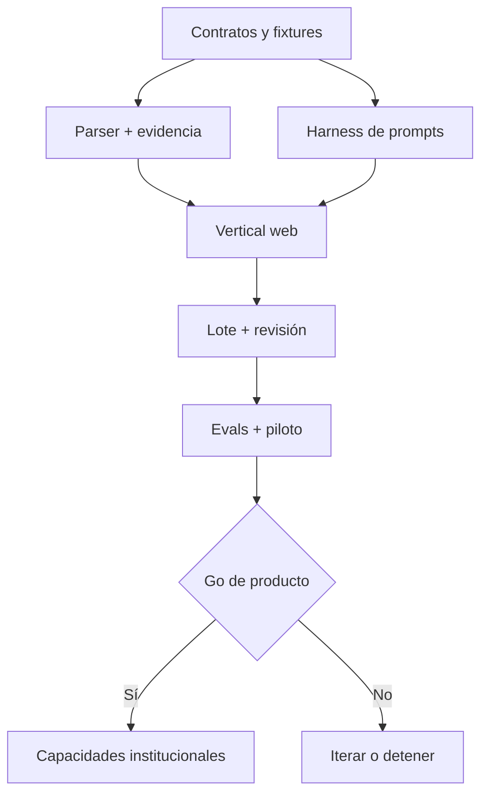

# Plan de implementación v1.1 - entorno web experimental

**Equipo de referencia:** dos desarrolladores técnicamente competentes con apoyo de Codex  
**Estrategia:** recorridos verticales, revisión humana 100%, un proveedor principal, contexto cerrado  
**Estado:** plan inmediato; la preparación institucional permanece condicionada a evidencia del piloto

**Aclaración ADR-037 (2026-08-14):** el objetivo formal es
P01→P02→P03→P04→preflight determinista→aprobación docente y, por submission,
P06→planner→P07→validaciones deterministas→revisión/aprobación docente→P09.
P05/P08 son inactivos en el objetivo, P10 sigue deshabilitado y el cutover del
runtime legado queda para una historia posterior. Las filas cerradas de Etapas
0/1 se conservan como historia y regresión, no como autoridad para reactivar
esas etapas.

---

## 1. Resultado que se busca

Construir un laboratorio web cloud donde docentes y ayudantes carguen manualmente una actividad y entregables, aprueben un blueprint, ejecuten el pipeline por estudiante, inspeccionen evidencia/preguntas/guías, editen o regeneren de forma localizada, aprueben individualmente o en lote y exporten cuando corresponda. El objetivo es medir calidad y utilidad; no completar un SaaS institucional.

### Gates del experimento

- 100% de preguntas seleccionadas resuelve evidence IDs y localizadores existentes;
- cero publicación automática, nota o decisión disciplinaria;
- 100% de assessments exportados fueron aprobados por una persona;
- 100% de planes `READY` tienen exactamente `question_count` oportunidades primarias; no existe evaluación parcial;
- fallos de evidencia, parsing, schema y proveedor se distinguen y se muestran sin fabricar contenido;
- aceptación docente, tipos de edición, latencia, tokens, costo y minutos de revisión quedan registrados;
- un cambio de prompt/modelo puede compararse con el baseline sobre fixtures/golden set;
- secretos, macros, código y enlaces no se ejecutan.

Los porcentajes de groundedness/aceptación de v1.0 se conservan como hipótesis de gate para el piloto, no como promesas del primer recorrido.

---

## 2. Forma de trabajo para dos desarrolladores

| Línea | Responsable primario | Responsable de revisión |
|---|---|---|
| Backend, contratos, jobs, parsers, gateway | Dev A | Dev B |
| Frontend, flujo docente, viewer, export | Dev B | Dev A |
| Prompts, evals, seguridad y métricas | compartido | revisión cruzada |

Reglas de ejecución:

1. Cada historia vertical incluye contrato, API, persistencia, UI mínima, telemetría y prueba.
2. Codex trabaja contra una historia y criterios de aceptación concretos; no decide cambios de constructo.
3. Los outputs probabilísticos se integran primero con fixtures y mocks, luego con un proveedor real.
4. Ninguna etapa espera a “terminar todo el backend”: el primer PDF atraviesa el sistema pronto.
5. Features institucionales permanecen detrás de decisiones explícitas de Etapa 4.

---

# Etapa 0 - Validación manual del núcleo

**Duración orientativa:** 1-2 semanas.  
**Objetivo:** demostrar con scripts y fixtures que los contratos y la secuencia semántica pueden producir preguntas trazables antes de invertir en la interfaz completa.

## Historias

| ID | Historia | Criterio de aceptación |
|---|---|---|
| E0-01 | Congelar contratos v1.1 | `models_v1.1.py` compila; bundle regenerable; roots/prompts/fixtures validan |
| E0-02 | Corpus mínimo sintético | >=3 actividades, con rúbrica ausente/presente, entrega suficiente/insuficiente e injection visible |
| E0-03 | Parser mínimo | TXT/MD y un PDF digital producen `EvidenceUnit` con hash y localizador reproducible |
| E0-04 | Harness P01-P11 | cada prompt tiene request/output root, mock, timeout, ledger y estado de abstención probado |
| E0-05 | Pipeline manual | consigna -> catálogo blueprint -> mapeo de variantes/oportunidades -> plan exacto \(N\) -> preguntas/review -> guía -> JSON sin pasos implícitos |
| E0-06 | Validadores críticos | rechazan IDs inventados, ancla no derivable, fuentes no autorizadas, schema extra y diagnóstico incompleto |
| E0-07 | Planificador inicial | devuelve exactamente \(N\) primarias + reserva o uno de cuatro diagnósticos específicos, sin conjunto parcial |
| E0-08 | Vistas mínimas | Assessment/EvaluationGuide fixtures se muestran por separado; export opcional no filtra guía al documento del estudiante |

## Dependencias

- Pydantic 2.13+, JSON Schema validator independiente y fixtures versionados;
- una librería PDF digital y Jinja2/WeasyPrint para verificar exportaciones en desarrollo;
- credenciales del proveedor solo para un smoke test autorizado; mocks por defecto.

## Riesgos y mitigaciones

| Riesgo | Mitigación |
|---|---|
| Afinar prompts sobre tres demos | reservar holdout desde el primer día y registrar defectos, no solo ejemplos exitosos |
| Saltar validadores por velocidad | el harness falla si un output llega al planificador/assembler sin checks requeridos |
| Diseñar UI antes de entender fallos | mantener Etapa 0 en CLI/notebook reproducible y capturar estados reales |

## Fuera de etapa

Autenticación, lote, upload directo a objetos, Cloud Run Jobs, OCR, DOCX completo, regeneración UI y LMS. La ejecución de Etapa 0 es exclusivamente desarrollo/pruebas/fixtures, no un entorno operativo local.

## Salida de etapa

Un comando procesa una actividad sintética y una entrega; produce JSON y PDFs o un diagnóstico fail-closed. Todos los artefactos se pueden reproducir desde hashes y fixtures.

---

# Etapa 1 - Primer recorrido vertical

**Duración orientativa:** 2-3 semanas después de Etapa 0.  
**Objetivo:** permitir que una persona use una aplicación web mínima para cargar consigna, rúbrica y un entregable y obtener blueprint, evidencia, preguntas, guía y PDF.

## Historias

| ID | Historia | Criterio de aceptación |
|---|---|---|
| E1-01 | Shell de aplicación y sesión simple | usuario autorizado entra a un workspace experimental; rutas privadas no son públicas |
| E1-02 | Crear actividad/configurar | captura título, idioma, modalidad, preguntas, tiempo, formatos y política de justificación; la profundidad y operaciones derivan del sistema/evidencia |
| E1-03 | Carga manual | consigna, rúbrica opcional y un PDF digital/TXT/MD se guardan en R2 privado con tamaño, MIME, hash y URL firmada temporal |
| E1-04 | Activity pipeline | P01-P05 producen specs, ambigüedades, blueprint review y versión aprobable |
| E1-05 | Pantalla de blueprint | muestra dimensiones, variantes, operaciones soportadas y catálogo de oportunidades; editar y aprobar crea nueva versión y ETag |
| E1-06 | Submission pipeline | parser -> mapa/variantes/oportunidades -> plan exacto \(N\) -> preguntas/reviews -> guía corre en Cloud Run Jobs |
| E1-07 | Progreso | UI diferencia `QUEUED`, `RUNNING`, `NEEDS_REVIEW`, `FAILED` y estado de dominio de la submission |
| E1-08 | Revisión evidence-first | pregunta muestra ancla, localizador, dimensión, operación, scores y diagnostics |
| E1-09 | Guía y export inicial | guía estructurada consultable en plataforma; evaluación/guía PDF opcionales más JSON canónico sin repetir llamadas a modelo |
| E1-10 | Métricas/rutas mínimas | ledger guarda provider, snapshot, modelo, effort, temperatura, reason codes, tokens, latencia, costo, intentos y resultado |
| E1-11 | Despliegue cloud | React/Vite + FastAPI en Cloud Run Service, Jobs en Cloud Run Jobs, Supabase PostgreSQL/Auth y R2 privado; GitHub + Cloud Build/Actions despliega; cerrar navegador no detiene job |

## Dependencias

- Etapa 0 aprobada;
- Supabase PostgreSQL/Auth y bucket privado Cloudflare R2;
- Cloud Run Service/Jobs con `jobs`/`stage_runs` y `stage_key` idempotente, sin Redis;
- rutas P01-P11 configuradas mediante adapter y resolvedor determinista.

## Riesgos y mitigaciones

| Riesgo | Mitigación |
|---|---|
| Infra cloud consume la etapa | mantener un solo servicio y Jobs; IaC mínima/reproducible, sin Redis ni separación prematura |
| PDF parece correcto pero ancla no resuelve | viewer abre la fuente exacta antes de permitir aprobación |
| Costos inesperados | `max_cost_usd` por job, tamaño máximo y estimación previa visible |

## Fuera de etapa

Múltiples entregables, edición/regeneración localizada completa, OCR, DOCX estructural, batch, comparador de modelos, administración institucional, LMS y aplicación al estudiante.

## Salida de etapa

Una persona completa el recorrido solicitado en cloud con una actividad y una entrega, cierra/reabre el navegador sin perder el job, aprueba el blueprint y consulta evaluación/guía; puede descargar vistas y JSON.

---

# Etapa 2 - Entorno experimental usable

**Duración orientativa:** 3-5 semanas.  
**Objetivo:** convertir el vertical slice en una herramienta repetible para experimentos docentes pequeños.

## Historias

| ID | Historia | Criterio de aceptación |
|---|---|---|
| E2-01 | Lote manual | cargar varios entregables, asignar `subject_ref` y ver tabla de estado/filtros sin mezclar evidencia |
| E2-02 | Formatos del primer prototipo | PDF digital, DOCX, TXT y MD tienen parser, límites, localizadores, viewer y fixtures |
| E2-03 | Jobs robustos | retry por clase, cancelación, reanudación por etapa y un fallo de submission no bloquean el resto del lote |
| E2-04 | Revisión por pregunta | aceptar, rechazar, editar o solicitar regeneración con motivo; cada acción crea `QuestionReviewAction` |
| E2-05 | Reemplazo localizado | usa una oportunidad de reserva, fingerprints rechazados y preserva preguntas aprobadas; nunca produce menos de \(N\) |
| E2-06 | Coverage report | dimensión, variante, oportunidad, evidencia, reutilización y diagnóstico visibles por entrega/actividad |
| E2-07 | Guía/exportaciones | guía estructurada se consulta en plataforma; PDF/HTML opcionales, coverage CSV/JSON y JSON canónico descargables con expiración |
| E2-08 | Métricas de experimento | aceptación, edición, rechazo, regeneración, defectos, fail-closed, latencia, tokens y costo por etapa/modelo |
| E2-09 | Feedback docente | valoración breve y comentario asociado a actividad/pregunta sin convertirlo automáticamente en training data |
| E2-10 | Seguridad mínima | contenedor de parsing con PyMuPDF/`python-docx`/`libmagic`, ClamAV cuando sea viable, límites, sanitización, CSP, rate limit y secretos fuera de logs |
| E2-11 | Staging sencillo | despliegue reproducible de app, worker, DB y objetos; datos sintéticos por defecto |
| E2-12 | Accesibilidad crítica | teclado, labels, foco, contraste y PDFs legibles en los flujos principales |
| E2-13 | Justificación configurable | `NOT_REQUIRED`/`SELECTED`/`ALL`; cada opción conserva rationale y distractor; reporte muestra alcance limitado cuando no es total |
| E2-14 | Aprobación masiva | docente o evaluator autorizado confirma una selección; elegibles se aprueban y excepciones quedan excluidas/auditadas para revisión individual |
| E2-15 | Aviso fijo de producto | footer/callout visible informa límites sobre autoría/IA/historia; no proviene de P09 ni aparece en documentos generados |
| E2-16 | Autoridad del pipeline formalizada | manifiesto versionado asigna una sola autoridad a cada decisión, marca P05/P08 inactivos y P10 deshabilitado sin cambiar routing/workflows |
| E2-17 | Evaluación histórica y oracle explícito | harness/qualifications legados no seleccionan modelo; `ORACLE_SUSPECT` nunca produce `MODEL_OWNED_*`; reportes sintéticos enumeran códigos content-free |

## Dependencias

- observabilidad y datos de Etapa 1;
- política provisional de datos/retención para el entorno controlado;
- conjunto de archivos DOCX/PDF representativos y autorizados.
- `pipeline-authority/1.0.0` como fuente del objetivo; el retiro operativo de
  P05/P08 exige una historia separada con migración compatible de jobs/estado.

## Riesgos y mitigaciones

| Riesgo | Mitigación |
|---|---|
| Lote provoca mezcla de estudiantes | bundle por submission, checks de tenant/submission y prueba negativa E2E |
| Edición rompe grounding | toda edición material vuelve a validación; diffs y lineage conservados |
| Más formatos diluyen calidad | habilitación por feature flag y gate de parser/viewer, no solo “abre el archivo” |
| Métricas de calidad se confunden con métricas del estudiante | nomenclatura explícita: defect/fail-closed describe sistema/actividad |

## Fuera de etapa

Uso sumativo, respuestas/calificación automática, OCR obligatorio, PPTX/XLSX/código en producción, multi-proveedor activo, alta disponibilidad, SAML/SCIM, facturación y LMS.

## Salida de etapa

Un docente puede ejecutar varias entregas, revisar y modificar resultados, reemplazar una pregunta desde reserva, usar la guía en plataforma, aprobar una selección elegible en lote y descargar vistas opcionales; el equipo puede medir el experimento de extremo a extremo.

---

# Etapa 3 - Piloto controlado

**Duración:** definida por reclutamiento y volumen, no por un sprint fijo.  
**Objetivo:** validar con docentes reales la propuesta pedagógica, comparar configuraciones/modelos y construir evidencia para decidir si avanzar.

## Historias

| ID | Historia | Criterio de aceptación |
|---|---|---|
| E3-01 | Protocolo de piloto | usos permitidos, consentimiento/base, retención, roles, soporte y canal de defectos aprobados |
| E3-02 | Golden set v1 | muestra estratificada, doble anotación, arbitraje, version/hash y holdout separado |
| E3-03 | Docentes reales | onboarding breve y tareas observadas; feedback cualitativo y cuantitativo trazable |
| E3-04 | Bake-off | mismos inputs/prompts/schemas; compara Luna-high vs Terra y P10 con OpenAI/Claude Sonnet/Gemini 3.6 Flash, priorizando grounding, citas, abstención, costo y política |
| E3-05 | Calibración | groundedness, answerability, suficiencia de ancla, aceptación y tiempo de review con intervalos |
| E3-06 | Privacidad operable | minimización, borrado, expiración de objetos, acceso restringido y registro de incidentes probados |
| E3-07 | Red team | injection en texto/metadata/OCR simulado, PII, fuente inventada, cross-submission y denial-of-wallet |
| E3-08 | Formatos posteriores | OCR/PDF scan, PPTX, CSV/XLSX o código se priorizan solo con demanda y corpus; cada uno pasa gate |
| E3-09 | Informe go/no-go | resultados, segmentos, defectos críticos, costo total y decisiones abiertas con owner/fecha |

## Dependencias

- Etapa 2 estable y logs/exports depurados;
- docentes y entregables autorizados;
- responsables pedagógicos y de privacidad disponibles por hitos.

## Riesgos y mitigaciones

| Riesgo | Mitigación |
|---|---|
| Muestra favorable o pequeña | estratificación, holdout, intervalos y declaración de límites |
| Docente acepta por automatización | revisión evidence-first, motivo de aceptación/edición y entrevistas |
| Bake-off filtra datos o cambia variables | dataset desidentificado, rutas aprobadas y protocolo fijo |
| Presión por usar notas reales | feature y política lo prohíben; cualquier cambio requiere ADR y evaluación separada |

## Fuera de etapa

Venta general, SLA, grade passback, automatización disciplinaria, despliegue multi-región y reducción de revisión humana.

## Salida de etapa

Informe reproducible que responde si el núcleo funciona, para qué tipos de actividad, con qué costo humano/técnico y qué defectos impiden expandir.

---

# Etapa 4 - Preparación para producto

**Entrada obligatoria:** go explícito de Etapa 3.  
**Objetivo:** diseñar y construir solo las capacidades institucionales respaldadas por demanda, riesgo y volumen observados.

## Historias candidatas, no compromiso actual

| ID | Capacidad | Gate para iniciarla |
|---|---|---|
| E4-01 | Multi-tenancy real, RLS y administración | dos o más instituciones y requisitos de aislamiento confirmados |
| E4-02 | SAML/SCIM/roles avanzados | requisito contractual y proveedor de identidad elegido |
| E4-03 | LTI 1.3 y primer LMS | institución/LMS inicial seleccionado y capability mapping aprobado |
| E4-04 | Canvas/Moodle/Blackboard adapters | demanda concreta, sandbox y scopes disponibles |
| E4-05 | Grade passback | validación sumativa, revisión humana, rectificación y ADR específico |
| E4-06 | Escala/HA/DR | SLO, concurrencia, residencia y presupuesto observados |
| E4-07 | Routing multi-proveedor | bake-off demuestra mejora y contratos de datos lo permiten |
| E4-08 | Comercialización/facturación | propuesta de valor, buyer, pricing y soporte validados |
| E4-09 | Formatos complejos | volumen y valor justifican parser, sandbox, viewer y golden corpus |

## Criterios de aceptación de la etapa

- cada capacidad tiene owner, ADR, threat model, costo y plan de migración;
- integraciones no contaminan el dominio canónico ni convierten IDs LMS en claves internas;
- no se reduce revisión ni se añade uso sumativo por simple presión comercial;
- SLO y arquitectura de escala se basan en telemetría, no en miles de usuarios hipotéticos.

## Fuera mientras no exista gate

Kubernetes, microservicios por entidad, marketplace, white-label, multi-región activa, BYOK, psychometrics de alto impacto y automatización de notas/disciplinas.

---

## 3. Secuencia técnica recomendada

---

## 4. Estrategia de pruebas

- unitarias: invariantes, state machines, costos, score/plan exacto, reserva, rutas y autorización masiva;
- contrato: Pydantic, JSON Schema, request/output de P01-P11 y OpenAPI;
- property/fuzz: IDs, locators, Unicode, longitudes, archives cuando se habiliten;
- integración: Supabase, R2, Cloud Run Service/Jobs, proveedor mock/real y renderer;
- golden/eval: grounding, answerability, ancla, guía, abstención y seguridad;
- causalidad de eval: estados `VALID`/`ORACLE_SUSPECT`/`INVALID`/
  `NOT_APPLICABLE`, precedence conservadora y compatibilidad de receipts;
- reporting: códigos estructurados en claro sólo para
  `SYNTHETIC_ONLY_NO_STUDENT_DATA`, con hash de integridad;
- E2E: actividad -> blueprint -> submission -> review -> export -> borrado;
- accesibilidad: axe, teclado y revisión manual de PDFs;
- seguridad: MIME, malware/injection, PII, cross-submission, rate/cost limits.

## 5. Definición de terminado por historia

Una historia no termina con una pantalla o una respuesta del modelo. Debe incluir:

1. contrato y migración si aplica;
2. autorización y validación de input;
3. happy path y abstención/fallo;
4. telemetría sin contenido sensible;
5. pruebas automáticas proporcionales al riesgo;
6. criterio visual/accesible si toca UI/PDF;
7. documentación mínima para reanudar o diagnosticar;
8. ausencia explícita de side effects institucionales no autorizados.

## 6. Decisiones abiertas y momento de cierre

| Decisión | Recomendación provisional | Información faltante | Cierre |
|---|---|---|---|
| Proveedor/modelos | routing retenido sin selección nueva; P10 deshabilitado | corpus/gate nuevo independiente; el harness actual es histórico | recalibrar Etapa 3 |
| Nube | Cloud Run Service/Jobs + Supabase + R2 | región y cuotas concretas | ratificar antes de datos reales |
| Jobs | Cloud Run Jobs + tablas PostgreSQL, sin Redis | duración/fallos/volumen | reevaluar E3/E4 |
| Formatos posteriores | por frecuencia y valor | corpus real | durante E3 |
| Retención institucional | mínimo temporal del piloto | política/legal/institución | antes de datos reales E3 |
| LMS inicial | ninguno | institución piloto y capabilities | E4 |
| Uso sumativo | no | evidencia de validez y gobernanza | después de E3, ADR separado |
| Arquitectura de escala | monolito modular | perfiles de carga y SLO | E4 |
| Comercialización/precio | abierto | willingness-to-pay y costo total | E4 |

## 7. Correspondencia con el plan v1.0

Las decisiones útiles de v1.0 se preservan, pero cambian de momento:

| Épicas v1.0 | Destino v1.1 |
|---|---|
| Charter, contratos, activity/blueprint, evidence, opportunities/plan/questions, guide | Etapas 0-2 |
| Evals, costos y piloto | Etapa 3 |
| Seguridad/privacidad | mínimo transversal en 0-2; hardening de piloto en 3 |
| Tenancy institucional, DR avanzado, LMS, scale | Etapa 4 |
| Kubernetes/microservicios/facturación/marketplace | no planificados hasta gate |
