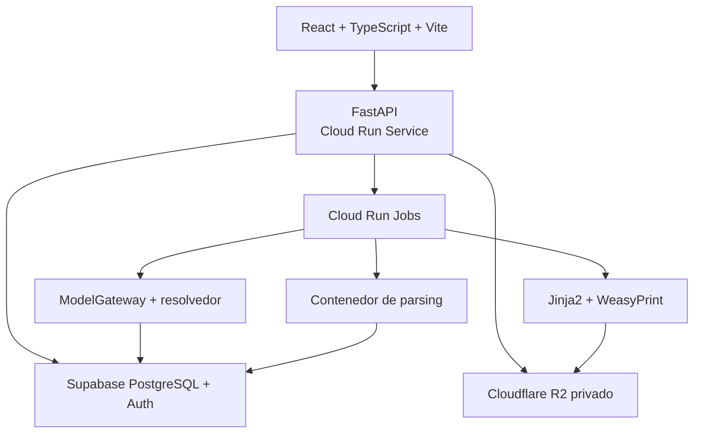

# Especificación inmediata - MVP entorno web experimental

**Versión:** 1.1  
**Propósito:** alcance directo para implementación asistida mediante Codex  
**Equipo:** dos desarrolladores  
**Principio:** laboratorio para validar el pipeline; no SaaS institucional terminado

**Aclaración ADR-037 / Fase 3 (2026-08-15):** P05/P08 permanecen legibles como
contratos/artefactos históricos, pero no son etapas activas objetivo. El
runtime ya retiró P05 mediante preflight durable y recovery compatible; P08 y
el orden objetivo de P09 siguen pendientes. P10 continúa deshabilitado.

---

## 1. Objetivo

Construir una aplicación web cloud invite-only donde profesores y ayudantes puedan cargar manualmente una actividad y entregables, configurar y aprobar un blueprint, ejecutar el pipeline por estudiante, inspeccionar cada artefacto intermedio, revisar/reemplazar preguntas, usar la guía estructurada en la plataforma, aprobar individualmente o en lote y descargar vistas opcionales.

El MVP debe responder tres preguntas:

1. ¿Las evaluaciones generadas están grounded, son respondibles y miden comprensión localizada?
2. ¿El flujo de revisión resulta útil y razonable para docentes?
3. ¿Qué modelos, configuraciones, formatos y etapas explican calidad, costo, fallos y tiempo humano?

No intenta demostrar escala institucional, integración LMS ni disposición a pagar.

---

## 2. Usuarios

| Rol | Puede | No puede |
|---|---|---|
| `OWNER` | invitar usuarios, ver configuración/costos agregados, crear y borrar actividades | cambiar contratos/prompts desde UI |
| `TEACHER` | crear actividad, aprobar blueprint, ejecutar, revisar, editar, regenerar, aprobar individualmente/en lote y exportar | administrar infraestructura o rutas sensibles |
| `ASSISTANT` | cargar entregas, ejecutar, revisar y proponer acciones; aprobar en lote solo con permiso expreso | aprobar blueprint o assessments sin el permiso correspondiente |

No existe rol estudiante en esta versión. Las evaluaciones se descargan para ser usadas fuera del sistema bajo criterio humano.

---

## 3. Flujo de usuario

1. El usuario crea una actividad.
2. Configura idioma, modalidad, preguntas, minutos, criterios prioritarios, formatos de respuesta y política de justificación. Profundidad y operaciones no son selectores de usuario.
3. Pega o carga consigna; carga rúbrica si existe.
4. El sistema procesa fuentes y genera `ActivitySpec`, `RubricSpec`, ambigüedades y blueprint.
5. El usuario resuelve asuntos bloqueantes, edita y aprueba el blueprint.
6. Carga uno o varios entregables con `subject_ref` seudónimo.
7. Inicia el pipeline; observa progreso por submission y etapa.
8. Abre una entrega y revisa evidencia, matches de variante, oportunidades, plan y preguntas/reviews.
9. En cada pregunta acepta, rechaza, edita o solicita regeneración localizada.
10. Aprueba el Assessment completo o selecciona varios elegibles, revisa el alcance y confirma una aprobación masiva; las excepciones quedan fuera.
11. Usa la guía dentro de la plataforma y, si lo necesita, descarga evaluación, guía, cobertura y JSON canónico.
12. Registra feedback; el sistema agrega métricas técnicas, económicas y de aceptación.

---

## 4. Funcionalidades incluidas

- actividades manuales y versionadas;
- rúbrica opcional;
- configuración de `ActivityConfig` y `BlueprintPolicy`;
- blueprint generado, revisado, editable y aprobable;
- carga de múltiples entregables;
- jobs asíncronos con progreso, retry controlado y diagnóstico;
- IR con evidencia/localizadores;
- P01-P04/P06/P07/P09 detrás de contratos v1.1; P05/P08 retenidos para compatibilidad y P10 deshabilitado;
- mapeo de variantes/oportunidades, plan determinista exacto de \(N\), generación, validaciones deterministas y revisión docente;
- fail-closed atómico: nunca una evaluación parcial;
- revisión evidence-first y acciones por pregunta;
- reemplazo localizado desde una oportunidad de reserva;
- aprobación masiva explícita con exclusiones auditadas;
- justificación estructurada `NOT_REQUIRED`/`SELECTED`/`ALL` y aviso de alcance limitado;
- guía estructurada principal en plataforma; evaluación/guía/coverage/JSON exportables como vistas;
- ledger de modelo y métricas básicas;
- feedback docente estructurado;
- autenticación sencilla y roles mínimos;
- despliegue cloud; local solo para desarrollo, pruebas y fixtures.

---

## 5. Funcionalidades excluidas

- Canvas, Blackboard, Moodle, LTI, roster y grade passback;
- aplicación de la evaluación dentro de la plataforma;
- captura o calificación de respuestas estudiantiles;
- nota automática, sanción, fraude o detección de IA;
- facturación, planes, marketplace o branding institucional;
- SAML, SCIM y administración jerárquica;
- multi-tenancy institucional avanzado, BYOK o regiones dedicadas;
- microservicios, Kubernetes, HA/DR contractual y multi-región;
- routing activo entre muchos proveedores;
- fine-tuning o entrenamiento con entregables;
- internet abierto, herramientas o ejecución de archivos por modelos;
- soporte exhaustivo de formatos.

---

## 6. Formatos iniciales

### 6.1 Primer prototipo

| Formato | Alcance | Justificación |
|---|---|---|
| TXT/Markdown | UTF-8, headings y líneas | muy bajo costo; ideal para fixtures y depuración |
| PDF digital | texto seleccionable, páginas y bbox | frecuencia alta, valor real y localizadores reproducibles |
| DOCX | headings, párrafos y tablas simples | frecuencia alta; estructura útil con complejidad moderada |

La consigna y rúbrica también pueden pegarse como texto. El primer recorrido vertical puede arrancar con TXT/MD + un PDF digital antes de completar DOCX.

### 6.2 Posteriores dentro del entorno experimental

| Formato | Condición de entrada |
|---|---|
| PDF escaneado/OCR | suficientes casos reales; corpus por idioma y umbral de confianza |
| PPTX | demanda docente y viewer de slide/shape/notas |
| CSV/XLSX | tareas tabulares frecuentes; fórmulas nunca se recalculan ni ejecutan |
| Código de texto/ZIP seguro | corpus por lenguaje, extractor seguro, Tree-sitter y exclusiones |

### 6.3 Arquitectura futura

IPYNB, imágenes/gráficos complejos, audio/video, repositorios grandes, CAD y binarios propietarios. Tienen mayor superficie de parsing, seguridad, estructura y costo multimodal; no son necesarios para validar la hipótesis central.

### Criterio de promoción de formato

Un formato se habilita solo si posee: límites, detección MIME, parser sandboxed, `EvidenceUnit`/locator, viewer, fixtures normales/adversariales, métricas de cobertura y comportamiento fail-closed.

---

## 7. Arquitectura concreta



### Componentes

- **Web:** React + TypeScript + Vite, formularios tipados y componentes accesibles; se sirve al comienzo desde el mismo contenedor que FastAPI. Vercel Pro es opcional más adelante; Hobby no se usa para un proyecto comercial.
- **API:** Python, FastAPI, Pydantic v2.13+, SQLAlchemy y Alembic en Google Cloud Run Service.
- **Jobs:** Google Cloud Run Jobs; la API persiste `jobs`/`stage_runs`, dispara la ejecución y responde. El job continúa si el navegador se cierra. No hay Redis inicial.
- **Datos/identidad:** Supabase PostgreSQL Free + Supabase Auth Free; snapshots JSONB y columnas normalizadas.
- **Objetos:** Cloudflare R2 privado con URLs firmadas temporales.
- **Parsing:** contenedor sin red con PyMuPDF, `python-docx`, `libmagic` y ClamAV cuando sea viable; límites de CPU/RAM/tiempo.
- **ModelGateway:** adapter propio pequeño, mocks para tests, catálogo de capacidades/rutas, resolvedor determinista, structured outputs, timeout, budget y ledger. Las llamadas pagadas reales se hacen solo en ejecuciones explícitas.
- **Render:** Jinja2 + WeasyPrint para vistas PDF/HTML opcionales.
- **CI/CD:** GitHub con Cloud Build o GitHub Actions hacia Cloud Run.

### Módulos internos

`auth`, `activities`, `artifacts`, `blueprints`, `submissions`, `evidence`, `planning`, `generation`, `validation`, `guides`, `review`, `exports`, `jobs`, `metrics`, `model_gateway`.

No se comparten tablas directamente desde el frontend. Los módulos se llaman mediante servicios de aplicación y repositorios.

---

## 8. Pantallas

| Pantalla | Contenido y acciones |
|---|---|
| Login/invitación | sesión, aviso de uso experimental y privacidad |
| Actividades | lista, estado, volumen, costo aproximado, crear/archivar |
| Crear/editar actividad | configuración, consigna, rúbrica, formatos, validación previa |
| Ambigüedades/blueprint | specs fuente, issues, dimensiones, variantes, operaciones soportadas, oportunidades, edit/approve/version |
| Entregables | carga múltiple, subject refs, estados, filtros, retry/cancel |
| Detalle de submission | timeline, artifacts, evidence units, matches, oportunidades, plan, coverage y diagnostics |
| Revisión de Assessment | pregunta, ancla, fuente, oportunidad/variante, scores, guía estructurada y acciones |
| Revisión masiva | selección, elegibilidad, versiones, confirmación, aprobados y excepciones |
| Exportaciones | vistas opcionales de evaluación/guía, cobertura, JSON, estado/expiración |
| Métricas experimentales | aceptación, ediciones, fallos, latencia, tokens, costo y review time |
| Configuración | proveedor/ruta administrada por entorno, límites y usuarios; sin secretos visibles |

La pantalla de revisión abre el fragmento exacto antes de aprobar; no oculta uncertainty detrás de un score agregado.

---

## 9. Endpoints

Prefijo `/api/v1`. Todos los mutables usan `Idempotency-Key`; ediciones versionadas usan `If-Match`.

### Actividades y blueprint

| Método | Ruta | Resultado |
|---|---|---|
| POST | `/activities` | crea `ActivityConfig` y actividad draft |
| GET/PATCH | `/activities/{activity_id}` | lee/edita mientras no haya blueprint aprobado |
| POST | `/activities/{activity_id}/artifacts/uploads` | crea upload session para consigna/rúbrica |
| POST | `/activities/{activity_id}/artifacts/{artifact_id}:complete` | verifica hash/MIME y registra |
| POST | `/activities/{activity_id}/blueprints:generate` | P01-P04 + `BLUEPRINT_PREFLIGHT`; cero P05 activo |
| GET | `/activities/{activity_id}/blueprints/{version}` | blueprint + preflight + issues; review P05 sólo si existe historia |
| PATCH | `/activities/{activity_id}/blueprints/{version}` | edición con ETag y job `BLUEPRINT_PREFLIGHT` |
| POST | `/activities/{activity_id}/decisions` | guarda `PolicyDecision` |
| POST | `/activities/{activity_id}/blueprints/{version}:approve` | congela blueprint |

### Submissions y pipeline

| Método | Ruta | Resultado |
|---|---|---|
| POST | `/activities/{activity_id}/submissions` | crea una o varias submissions/subject refs |
| POST | `/submissions/{submission_id}/artifacts/uploads` | upload session |
| POST | `/submissions/{submission_id}/artifacts/{artifact_id}:complete` | completa carga |
| POST | `/submissions/{submission_id}:run` | inicia pipeline completo |
| POST | `/activities/{activity_id}/submissions:run` | inicia pendientes del lote |
| GET | `/submissions/{submission_id}` | `SubmissionProcessingState` y resumen |
| GET | `/submissions/{submission_id}/evidence` | evidencia paginada y resoluble |
| GET | `/submissions/{submission_id}/opportunities` | matches, oportunidades, plan y reviews autorizados |
| GET | `/submissions/{submission_id}/assessment` | Assessment vigente y coverage |

### Revisión y export

| Método | Ruta | Resultado |
|---|---|---|
| POST | `/assessments/{assessment_id}/questions/{question_id}/actions` | `QuestionReviewAction` |
| POST | `/assessments/{assessment_id}/questions/{question_id}:regenerate` | reemplazo desde oportunidad de reserva |
| GET | `/assessments/{assessment_id}/guide` | `EvaluationGuide` para roles autorizados |
| POST | `/assessments/{assessment_id}:approve` | aprobación humana completa |
| POST | `/assessments:bulk-approve` | `BulkApprovalRequest` -> `BulkApprovalRecord` |
| POST | `/assessments/{assessment_id}/exports` | crea evaluación/guía/coverage/JSON |
| GET | `/exports/{export_id}` | estado y URL temporal |
| POST | `/feedback` | feedback docente estructurado |

### Jobs y métricas

| Método | Ruta | Resultado |
|---|---|---|
| GET | `/jobs/{job_id}` | `JobStatus`, stage runs y diagnostics seguros |
| POST | `/jobs/{job_id}:retry` | solo si error clasificado retryable |
| POST | `/jobs/{job_id}:cancel` | cancelación cooperativa |
| GET | `/activities/{activity_id}/metrics` | métricas agregadas experimentales |

---

## 10. Jobs

La tabla distingue el runtime activo de los estados que siguen legibles por
compatibilidad. Fase 3 reemplazó `BLUEPRINT_BUILD_REVIEW`; P08 conserva todavía
su job/estado activo hasta una fase posterior.

| Job/stage | Input | Output | Retry |
|---|---|---|---|
| `ACTIVITY_PARSE` | artifacts de consigna/rúbrica | EvidenceUnits fuente | un fallback de parser |
| `ACTIVITY_SPEC` | `ActivitySpecRequest` | `ActivitySpec` | técnico/P11 |
| `RUBRIC_NORMALIZE` | request P02 | `RubricSpec` | técnico/P11 |
| `BLUEPRINT_BUILD` | request P04 | `AssessmentBlueprint` compilado | provider/cache gobernado existente |
| `BLUEPRINT_PREFLIGHT` | blueprint + spec/rubric/policy/decisiones | blueprint READY/NEEDS_REVIEW + preflight | determinista; reuse hash-bound |
| `BLUEPRINT_REVIEW` | descriptor P05 anterior al corte | reconciliación por preflight, sin provider | LEGACY/HISTORICAL; retry/resume compatible |
| `SUBMISSION_PARSE` | artifacts submission | EvidenceUnits | un fallback aprobado |
| `EVIDENCE_MAP` | request P06 | claims, variant matches y oportunidades | bundle corregido |
| `ASSESSMENT_PLAN` | oportunidades + policy | exactamente \(N\) primarias + reserva o diagnóstico | no retry sin input/policy nuevo |
| `QUESTION_GENERATE` | request P07/P10 por oportunidad | `QuestionGenerationResult` | reemplazo desde reserva |
| `QUESTION_REVIEW` | request P08 | `QuestionReviewResult` | LEGACY; cutover a validadores + docente pendiente |
| `GUIDE_BUILD` | request P09 | `EvaluationGuide` | objetivo: después de preguntas aprobadas; no reparación semántica |
| `ASSEMBLE` | plan + preguntas + guía + lineage | Assessment | determinista y atómico |
| `RENDER_EXPORT` | Assessment | archivos derivados | retry sin LLM |

Cada stage persiste `input_hash`, `component_version`, intento, timestamps, output ref y diagnostics. Un stage completo se reutiliza si su clave coincide.

---

## 11. Estados

Se separan dos ejes para no confundir ejecución y resultado.

### Job técnico

`QUEUED -> RUNNING -> SUCCEEDED | FAILED | NEEDS_REVIEW`.

### Submission de dominio

`UPLOADED -> VALIDATING -> PARSING -> EVIDENCE_READY -> MAPPING_OPPORTUNITIES -> PLANNING -> GENERATING -> VALIDATING_QUESTIONS -> GUIDE_READY -> NEEDS_REVIEW -> APPROVED`.

Terminales para una versión: `INSUFFICIENT_RELEVANT_EVIDENCE`, `INSUFFICIENT_DISTINCT_QUESTION_OPPORTUNITIES`, `EVIDENCE_MAPPING_UNCERTAIN`, `ASSESSMENT_PLAN_INFEASIBLE`, `TECHNICAL_FAILURE`, `REJECTED_SECURITY`, `CANCELLED`. Un retry o archivo corregido crea nueva ejecución; no muta el historial.

La posición actual de `GUIDE_READY` es legacy. El cutover posterior debe
introducir una transición durable de revisión/aprobación de preguntas antes de
P09 sin reusar estados de manera ambigua.

### Assessment

`DRAFT -> READY -> NEEDS_REVIEW -> APPROVED`. Un objeto utilizable contiene exactamente `question_count` preguntas. `PUBLISHED` queda reservado para producto futuro; exportar no equivale a publicar una nota.

---

## 12. Modelo de datos utilizado

| Tabla | Datos principales |
|---|---|
| `workspaces` | tenant experimental, nombre, settings mínimos |
| `users`, `workspace_roles` | identidad y rol simple |
| `activities` | config vigente, estado, owner, timestamps |
| `activity_artifacts` | role, object key, MIME, bytes, hash, parser |
| `activity_specs`, `rubric_specs` | snapshots JSONB v1.1 |
| `blueprints` | version, status, policy, review, aprobación |
| `policy_decisions` | issue/opción/actor/fecha |
| `submissions` | activity, subject_ref, status, progress |
| `submission_artifacts` | objeto, hash, media type, estado |
| `evidence_units` | EvidenceUnit JSONB + columnas ID/artifact/modality/locator |
| `evidence_claims`, `evidence_variant_matches` | claims, alignments dimensión/variante, patch/version |
| `question_opportunities`, `assessment_plans` | oportunidades concretas, primarias/reserva y diagnósticos |
| `generated_questions`, `question_reviews` | preguntas por oportunidad, scores y vetos |
| `assessments`, `assessment_questions`, `evaluation_guides` | Assessment/version, preguntas y guía estructurada |
| `question_review_actions` | acción, actor, motivo, before/after |
| `bulk_approval_records`, `bulk_approval_exclusions` | actor, fecha, scope, versiones, aprobados y excepciones |
| `jobs`, `stage_runs` | estado, idempotencia, attempts, diagnostics |
| `model_calls` | ModelCallLedger |
| `audit_events` | DomainEvent versionado; payload mínimo por tipo registrado |
| `exports` | tipo, hash, object key, expiry, status |
| `feedback_events` | rating, categoría, comentario, target IDs |

Los blobs nunca se guardan en PostgreSQL. Los JSONB completos son fuente del snapshot; columnas derivadas aceleran consultas y se reconstruyen.

---

## 13. Integración con los prompts

| Prompt | Momento | Root request | Root output | Control posterior clave |
|---|---|---|---|---|
| P01 | actividad | ActivitySpecRequest | ActivitySpec | evidence IDs/roles |
| P02 | actividad, si hay rúbrica | RubricNormalizeRequest | RubricSpec | pesos/criteria/verification_fit |
| P03 | actividad | AmbiguityTriageRequest | AmbiguityReport | issue/options/blocking |
| P04 | actividad | BlueprintBuildRequest | BlueprintModelDraft -> AssessmentBlueprint compilado | catálogo semántico propuesto; IDs/policy/estado y preflight en backend + docente |
| P05 | histórico | BlueprintReviewRequest | BlueprintReview | INACTIVE_TARGET; lectura compatible |
| P06 | submission | EvidenceMapRequest | EvidenceMapPatch | matches/oportunidades/operaciones permitidas |
| P07 | oportunidad cerrada | QuestionBuildRequest | QuestionGenerationResult | validaciones backend + revisión docente |
| P08 | histórico | QuestionReviewRequest | QuestionReviewResult | INACTIVE_TARGET; lectura compatible |
| P09 | preguntas aprobadas | GuideBuildRequest | EvaluationGuide | question/source/levels; sin aviso global generado |
| P10 | oportunidad enriquecida posterior | QuestionBuildRequest | QuestionGenerationResult | citations/source IDs |
| P11 | fallo estructural | SchemaRepairRequest | SchemaRepairResult | revalidar schema objetivo |

En el primer prototipo se habilita `CLOSED`; P10 permanece deshabilitado aunque
su contrato siga siendo legible. Habilitarlo exige decisión nueva y corpus
autorizado.

Las rutas iniciales se conservan como historia/configuración compatible y no se
modifican aquí. P05 ya no es alcanzable por ejecuciones nuevas; P08 no es activa
en el objetivo pero su cutover está pendiente. El harness actual no es
un gate canónico para escoger modelo. Cualquier comparación futura requiere un
instrumento nuevo gobernado; no se implementa en este MVP change.

`ModelGateway` no elige dinámicamente. Resuelve una unidad `provider + snapshot + model + reasoning_effort + temperature + output_limits`, comprueba modalidades/capabilities, privacidad, región, retención, presupuesto, disponibilidad y fallback aprobado, y guarda reason codes estables. Una imagen no cambia de proveedor por sí sola; se envía solo el crop sanitizado. Gemini puede aprobarse para PDF/audio/video nativos o ventaja medida, nunca como fallback genérico. Sin ruta compatible: `NEEDS_REVIEW` o `BLOCKED`.

---

## 14. Almacenamiento

Prefijos privados:

```text
raw/{workspace_id}/{activity_id}/{artifact_id}
derived/{workspace_id}/{artifact_hash}/{parser_version}/...
exports/{workspace_id}/{assessment_id}/{export_id}/...
```

- uploads/downloads con URL firmada temporal de R2;
- allowlist de MIME/tamaño antes de marcar complete;
- objetos raw/derived/export separados lógicamente;
- cifrado del proveedor, deny-public y URLs de descarga temporales;
- hash antes y después de transferencia;
- workspaces efímeros de parser eliminados tras job;
- lifecycle provisional configurable; política institucional queda abierta.

PostgreSQL conserva registros estructurados, relaciones, estados y auditoría. R2 conserva raw, derivados binarios, JSON grandes y exportaciones; no se desplazan blobs a la base.

---

## 15. Autenticación

- Supabase Auth invite-only;
- local dev con usuario seed solo para pruebas/fixtures, claramente deshabilitado en cloud;
- sesión corta, cookies `HttpOnly`, `Secure`, `SameSite=Lax`;
- backend verifica issuer/audience/expiry y resuelve rol del workspace;
- autorización server-side en cada repository/service;
- no SAML/SCIM; `AuthProvider` desacopla proveedor futuro.

---

## 16. Revisión docente

La revisión humana es obligatoria. Puede cerrarse de forma granular o, tras la inspección necesaria, mediante una operación masiva explícita.

- **Aceptar:** mantiene pregunta y registra actor/fecha.
- **Rechazar:** requiere motivo estructurado; la pregunta no puede entrar al Assessment aprobado.
- **Editar:** crea replacement y ejecuta validaciones de fuente, formato, leakage y guía; conserva diff.
- **Regenerar:** requiere motivo, bloquea fingerprint y usa una oportunidad de reserva.
- **Aprobar Assessment:** solo si toda pregunta final tiene una acción aceptada o edición validada y no hay diagnóstico crítico.
- **Aprobar selección:** solo `TEACHER` o `ASSISTANT` con permiso expreso; muestra cantidad/versiones, exige confirmación literal y aprueba únicamente elegibles. Toda excepción se excluye, se audita y requiere revisión individual.

Motivos mínimos: `GROUNDING`, `ANSWERABILITY`, `TRIVIAL`, `AMBIGUOUS`, `REDUNDANT`, `WRONG_DIFFICULTY`, `WRONG_FORMAT`, `GUIDE_DEFECT`, `PII`, `OTHER`.

Para preguntas de selección, `student_justification_required` se resuelve desde `NOT_REQUIRED`, `SELECTED` o `ALL` por actividad/oportunidad. Omitirla es válido en usos breves, formativos o de bajo impacto. Independientemente de ese booleano, la guía conserva la mejor respuesta defendible, evidencia fuente, rationale de cada opción y confusión asociada a cada distractor.

---

## 17. Exportaciones

| Tipo | Contenido |
|---|---|
| Evaluación PDF | identificación seudónima, instrucciones, preguntas/anclas; nunca guía/scores |
| Guía en plataforma | representación principal estructurada: pregunta, propósito, observables, niveles, alternativas y fuentes |
| Guía PDF/HTML | vista opcional de la guía estructurada |
| Cobertura CSV/JSON | dimensión, variante, oportunidad, status, evidence count, reutilización y diagnostics |
| JSON canónico | Assessment + EvaluationGuide v1.1 y lineage; uso técnico/auditoría |

Todos incluyen versión, ID y hash. Un error de render se reintenta desde JSON sin llamar al modelo.

El aviso general sobre los límites para inferir autoría, uso de IA o proceso histórico es un footer/callout fijo de la UI. No se genera con P09 ni se añade a los documentos generados por el modelo. Si la justificación estructurada no se exige en todas las preguntas, el reporte muestra además un aviso determinista de alcance limitado de evidencia.

---

## 18. Observabilidad

### Técnico

job/stage success, queue wait, duration p50/p95, retries, parser failure, provider error, render error.

### Económico

input/cached/output tokens, route/model, estimated/actual cost, OCR pages, storage, costo por activity/submission/question y minutos humanos.

### Calidad/uso

opportunity yield, plan exacto/fail-closed, critical veto, coverage, reutilización, aceptación sin cambio, edición menor/mayor, rechazo, reemplazo, question defect y feedback.

Logs usan IDs y tamaños; no texto completo, anclas, nombres ni secretos. Trazas conectan request -> job -> stage -> model call -> export mediante correlation ID.

---

## 19. Seguridad mínima

- MIME real, extensión secundaria, tamaño y hash;
- rechazar cifrado, macros y contenido activo no soportado;
- parser sin red, no root, filesystem temporal y límites; PyMuPDF/`python-docx`/`libmagic`, con ClamAV cuando sea viable;
- nunca ejecutar código, notebooks, fórmulas, OLE, links o imports;
- modelos sin herramientas, navegación ni memoria entre submissions;
- allowlist de evidence/source IDs por llamada;
- CSP, CSRF/session controls, sanitización HTML y escape de outputs;
- rate limit por usuario/workspace y budget por job;
- secretos en secret manager/env segura, nunca DB/log/frontend;
- consultas siempre scoped por workspace/submission;
- URLs firmadas, objetos privados y auditoría de descargas;
- dependencia/SAST/container scan en CI;
- fixtures de prompt injection y cross-submission.

ClamAV puede omitirse solo en fixtures locales controlados cuando su ejecución no sea viable; antes de un piloto con archivos reales debe existir AV o un control compensatorio explícitamente aprobado.

---

## 20. Despliegue

### Desarrollo y pruebas

Local se limita a código, tests, fixtures y mocks. Puede usarse un entorno efímero para iterar, pero no procesa jobs reales ni es una alternativa operativa al cloud.

### Entorno cloud experimental

- React/Vite se construye y sirve inicialmente desde el mismo contenedor que FastAPI en Cloud Run Service;
- Cloud Run Jobs ejecuta trabajos largos y parsing; la API persiste el job antes de dispararlo;
- Supabase PostgreSQL Free + Auth Free;
- Cloudflare R2 privado y URLs firmadas temporales;
- GitHub + Cloud Build o GitHub Actions para build/deploy;
- migraciones como paso controlado y secrets administrados;
- Jinja2 + WeasyPrint para exportaciones;
- sin Redis, MinIO ni worker permanente.

El costo fijo esperado es cercano a USD 0 mientras el uso permanezca dentro de cuotas gratuitas, más las APIs de modelos. Los primeros costos fijos probables son sobreconsumo o Vercel Pro si luego se separa el frontend. Vercel Hobby se reserva a uso personal/no comercial. No existe producción institucional en Etapas 0-2.

---

## 21. Pruebas

| Nivel | Casos obligatorios |
|---|---|
| Unit | validators, states, idempotency, score/plan/reserva, rutas, permisos/bulk approval y costos |
| Contract | cada root, schema generation, extra fields, enums, P01-P11 fixtures |
| Parser | PDF/DOCX/TXT/MD normales, vacíos, corruptos, injection y tamaños límite |
| Integration | Supabase/R2/Cloud Run Jobs/provider mock/renderer |
| E2E | actividad, blueprint, 2 submissions, una insuficiente, review, regen, export |
| Security | cross-workspace/submission, unsigned upload, PII/log, injection, budget |
| Golden | grounding, answerability, anchor, guide y abstention |
| Eval policy | cuatro estados de oracle; sospecha bloquea `MODEL_OWNED_*`; harness histórico no selecciona modelo |
| Reporting | códigos claros + hash sólo en reportes sintéticos; sin cambio content-free de datos reales |
| Visual/accessibility | pantallas críticas, teclado, foco y PDFs sin clipping/leakage |

El CI no llama modelos reales. Los smoke/evals reales son jobs manuales con presupuesto y dataset autorizados.

---

## 22. Criterios de aceptación

El entorno experimental usable termina cuando:

1. se crea una actividad con rúbrica opcional y configuración completa;
2. el blueprint se puede revisar, editar, aprobar y versionar;
3. se cargan al menos dos entregables y corren independientemente;
4. estados y fallos son visibles sin recargar datos de otra submission;
5. cada pregunta final abre evidencia/localizador existente;
6. un caso insuficiente termina sin evaluación parcial y con uno de los diagnósticos específicos;
7. se puede aceptar, rechazar, editar y regenerar una pregunta;
8. regenerar usa una oportunidad de reserva, preserva las demás preguntas y no pierde lineage;
9. Assessment no se aprueba sin revisión humana;
10. la guía estructurada se consulta en plataforma; las vistas descargables corresponden por IDs;
11. tokens, costo, latencia, fallos, acciones y minutos de review son consultables;
12. una selección elegible puede aprobarse en lote con confirmación; excepciones quedan excluidas/auditadas;
13. política de justificación y aviso de alcance limitado se reflejan correctamente;
14. tests de contrato, E2E, seguridad crítica y render pasan en cloud.

---

## 23. Decisiones abiertas

| Decisión | Provisional | Falta | Cierre |
|---|---|---|---|
| proveedor/modelo | sin selección nueva; P10 deshabilitado | corpus y gate independientes del harness histórico | recalibrar Etapa 3 |
| cloud | Cloud Run Service/Jobs + Supabase + R2 | región y cuotas concretas | ratificar antes de datos reales |
| orquestación futura | Cloud Run Jobs + tablas, sin Redis | duración/volumen reales | reevaluar Etapa 3/4 |
| identidad | Supabase Auth invite-only | políticas finales | ratificar antes de datos reales |
| OCR/formatos 2 | feature flags | mix real de archivos | durante piloto |
| corpus de curso/P10 | deshabilitado | materiales/licencias/evals | piloto posterior |
| retención | mínima y configurable | requisito institucional/legal | antes de datos reales |
| LMS | ninguno | institución y LMS de entrada | Etapa 4 |
| uso sumativo | no | validez, gobernanza y apelación | ADR futuro |
| escala/comercial | abierto | telemetría y demanda | Etapa 4 |

---

## 24. Límites conocidos

- La calidad del parser limita todo downstream; un schema válido no corrige evidencia perdida.
- Grounding no garantiza valor pedagógico; requiere juicio docente y golden set.
- Dificultad y tiempo estimados no están calibrados hasta observar respuestas reales.
- Preguntas personalizadas pueden no ser comparables en todos los formatos/disciplinas.
- Un entregable suficiente no demuestra autoría y uno insuficiente no demuestra fraude.
- La guía apoya evaluación; no es una respuesta histórica verdadera ni calificación automática.
- Costos de modelos/precios son supuestos fechados y editables.
- La revisión humana puede dominar el costo total.
- El entorno cloud experimental no ofrece SLA, HA, residencia contractual ni controles institucionales completos.
- El diseño conserva seams futuros, pero una decisión de producto real requerirá migraciones y nuevos ADRs.
